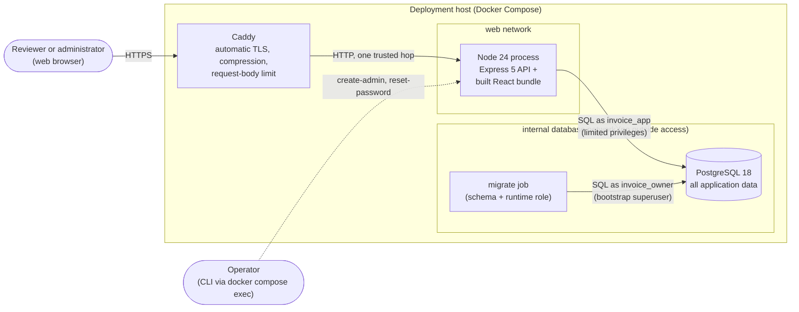
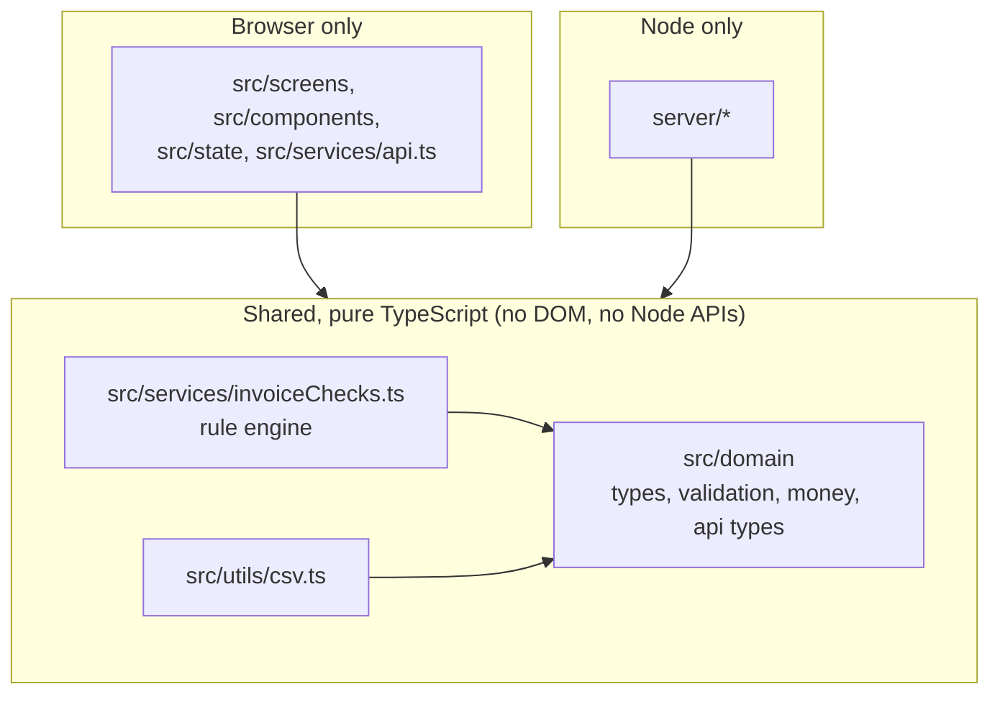
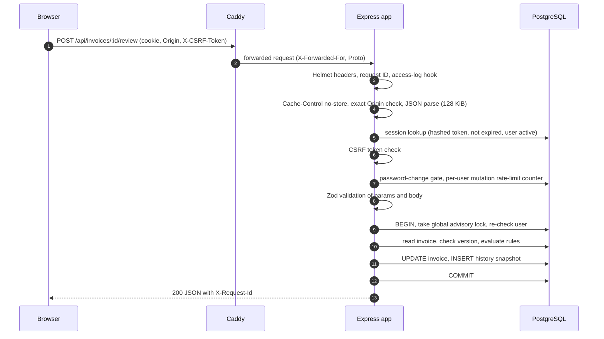

# 2. Architecture

> Part of the [Invoice Exception Assistant specification](./README.md). Applies to version **1.0.0**.

This document describes the moving parts, how code is organized, how a request travels through the
system, and the reasoning behind the main design choices.

## 2.1 System context



There are **no outbound integrations**: the application never calls an OCR service, e-mail server, ERP,
bank or any third-party API. Only the `database` network is `internal`, so the **database** (and the one-shot
migrate job) cannot reach the internet. The API container is also attached to the ordinary `web` network so the
proxy can reach it, which means its outbound traffic is **not** restricted by Compose; it simply has no code
that makes outbound calls ([§8.13](./08-security.md#813-known-gaps-and-residual-risks)).

## 2.2 Components

| Component | Technology | Responsibility |
| --- | --- | --- |
| **Browser app** | React 18 single-page app (Vite build) | Presentation, form handling, client-side convenience validation. Holds no durable data. |
| **API server** | Node 24, Express 5, TypeScript | Authentication, authorization, validation, the rule engine, every state change, document handling, CSV generation. Also serves the built browser app in production. |
| **Database** | PostgreSQL 18 | The only store: accounts, sessions, rate-limit counters, reference data, invoices (including document bytes), history, audit events, export batches. |
| **Reverse proxy** | Caddy 2 | TLS termination and certificate automation, compression, an 11 MB request-body ceiling, forwarded-client-IP header. |
| **Migrate job** | Same image as the API | Applies SQL migrations and (re)provisions the limited runtime role, then exits. |
| **Operator CLI** | [`server/cli.ts`](../server/cli.ts) | Bootstrap/recovery tasks that must work without the web UI: migrate, provision role, create admin, reset password, seed demo data. |
| **Test harness** | Vitest, Testing Library, Playwright, embedded PostgreSQL | See [Testing](./11-testing-and-quality.md). |

## 2.3 Technology stack

Declared ranges live in [`package.json`](../package.json); exact versions are pinned by
[`package-lock.json`](../package-lock.json). The "resolved" column is a snapshot from 2026-10-02.

| Layer | Library | Resolved | Used for |
| --- | --- | --- | --- |
| Runtime | Node.js | 24.x (`.nvmrc`, `engines`) | API, CLI, tooling |
| Language | TypeScript | 5.7 | Strict typing for server, browser and tests |
| Web framework | Express | 5.2 | Routing, middleware; forwards async errors to the error handler |
| HTTP hardening | Helmet | 8.3 | Security headers and CSP |
| Uploads | Multer | 2.4 (memory storage) | `multipart/form-data` parsing with hard limits |
| File sniffing | file-type | 21.3 | Detect real file type from bytes |
| Validation | Zod | 4.6 | Every request body/query, configuration, and client-side form checks |
| Database driver | pg (node-postgres) | 8.23 | Pool, transactions, parameterized SQL |
| Logging | Pino | 10.3 | Structured JSON logs |
| Cookies | cookie | 1.1 | Parsing the session cookie |
| Config | dotenv | 17 | Loading `.env` in development |
| UI | React / React DOM | 18.3 | Components |
| Routing | React Router | 7.18 (data router) | URLs, deep links, unsaved-change blocking |
| Bundler / dev server | Vite | 8.3 (+ `@vitejs/plugin-react` 6) | Dev server with API proxy; production bundle |
| Unit/UI tests | Vitest 5, jsdom, Testing Library, user-event | | See [Testing](./11-testing-and-quality.md) |
| Browser tests | Playwright | 1.63 (Chromium) | End-to-end |
| Test database | embedded-postgres | 18.4 (beta tag) | Real PostgreSQL for API tests without Docker |
| Lint | ESLint 10, typescript-eslint 8, react-hooks plugin | | Static analysis |
| Dev runner | tsx, concurrently | | `npm run dev` |
| Proxy | Caddy | 2 (`caddy:2-alpine`) | HTTPS |
| Database image | `postgres:18` | | Production and development databases |

## 2.4 Repository layout

```text
.
├── README.md                 Quick start, configuration summary, launch checklist
├── docs/                     Task-oriented guides (API summary, operations runbook, test guide)
├── spec/                     This specification
├── server/                   Node API + CLI + migrations (TypeScript, NodeNext modules)
│   ├── index.ts                Process entry: config → pool → schema check → HTTP server → shutdown
│   ├── app.ts                  Express app factory: middleware order, every route, error mapping
│   ├── config.ts               Environment parsing and validation (Zod)
│   ├── auth.ts                 Password hashing, sessions, cookies, CSRF, admin guard, rate limiter
│   ├── accounts.ts             User administration and password change
│   ├── invoices.ts             Invoice create / update / review / export workflows; document validation
│   ├── catalog.ts              Supplier, purchase-order and goods-receipt creation
│   ├── repository.ts           Read queries, summaries, history/audit/export listings, rule context
│   ├── database.ts             Pool, transactions, the global workflow lock, migrations, role provisioning
│   ├── errors.ts               HttpError
│   ├── seed.ts                 Development-only sample-data loader
│   ├── cli.ts                  Operator commands
│   └── migrations/             Versioned SQL (001_initial.sql)
├── src/                      Browser app + code shared with the server
│   ├── main.tsx, App.tsx       Bootstrap, route table, auth gate
│   ├── domain/                 types.ts, validation.ts, money.ts, api.ts      ← shared
│   ├── services/               invoiceChecks.ts (rule engine)                  ← shared
│   │                           api.ts (browser HTTP client)                    ← browser only
│   ├── utils/csv.ts            CSV builder                                     ← used by the server
│   ├── data/demoData.ts        Synthetic sample dataset (seed data + test fixtures)
│   ├── state/appState.tsx      Session state, request wrapper, useResource, useDebouncedValue
│   ├── components/             Layout, InvoiceForm, ReferenceSelect, LineItemsEditor, Feedback, ...
│   ├── screens/                Login, Account, Dashboard, InvoiceQueue, InvoiceReview, Upload,
│   │                           Exports, ReferenceData, Users
│   ├── test/                   Test setup and helpers
│   └── styles.css              The single stylesheet
├── tests/                    API integration tests, Playwright specs, test infrastructure
├── deploy/Caddyfile          Reverse-proxy configuration
├── scripts/copy-assets.mjs   Copies SQL migrations into the compiled server output
├── public/favicon.svg
├── Dockerfile, compose.yaml, compose.dev.yaml
├── .github/                  CI workflow and Dependabot configuration
├── .env.example, .env.production.example
├── images/                   Screenshots of the OLD 0.1.0 demo (stale; see §1.8)
├── pgm.py                    Unrelated stub (see §1.8)
└── generated, ignored by .gitignore:
    node_modules/  dist/ (browser bundle)  build/ (compiled server)  coverage/
    playwright-report/  test-results/  *.tsbuildinfo
```

## 2.5 Code organization and dependency rules



Rules of the road:

1. **Shared modules are pure.** `src/domain/*`, `src/services/invoiceChecks.ts` and `src/utils/csv.ts`
   contain no browser or Node-specific APIs, so they are compiled twice: by Vite for the browser and by
   `tsc -p tsconfig.server.json` for the server. This is what guarantees that "the rules the UI shows"
   and "the rules the server enforces" are the same code.
2. **The server never imports UI code; the UI never imports `server/`.** Shared modules use `.js`
   extensions in their relative imports (required by the server's `NodeNext` resolution; Vite resolves them
   too). UI-only modules import without extensions.
3. **Validation lives once.** Every input shape is defined as a Zod schema in
   [`src/domain/validation.ts`](../src/domain/validation.ts). The server parses with it; forms parse with
   the same schema before submitting. The server's answer is authoritative.
4. **All mutations go through `workflow()`.** Business writes call
   [`workflow()`](../server/database.ts), which opens a transaction, takes the global lock, and re-checks
   the acting user before running the operation. Nothing else writes finance data.

There is no automated import-boundary lint; rules 1–2 are enforced by convention, by the narrow `include`
list in [`tsconfig.server.json`](../tsconfig.server.json), and by review.

## 2.6 Build and packaging pipeline

`npm run build` runs, in order:

1. **`npm run typecheck`** – `tsc --noEmit` against three projects: `tsconfig.app.json` (browser + tests),
   `tsconfig.server.json` (server + shared code), `tsconfig.node.json` (tool configs and `tests/`).
2. **`tsc -p tsconfig.server.json`** – emits ES modules and source maps to **`build/`**
   (`build/server/*.js` plus the compiled shared files under `build/src/`).
3. **`node scripts/copy-assets.mjs`** – copies `server/migrations/` to `build/server/migrations/` (the
   TypeScript compiler does not copy `.sql`).
4. **`vite build`** – emits the browser bundle to **`dist/`** (`index.html`, hashed JS/CSS under `assets/`,
   `favicon.svg`).

The production image ([`Dockerfile`](../Dockerfile)) is multi-stage: the first stage installs all
dependencies and runs `npm run build`; the second installs **production dependencies only**
(`npm ci --omit=dev --ignore-scripts`) and copies in `build/` and `dist/`. It runs as the unprivileged `node`
user and declares a `HEALTHCHECK` against `/api/health/ready`.

At run time the compiled server locates the browser bundle at `<root>/dist` relative to
`build/server/app.js`. That is why `build/` and `dist/` must be shipped together.

## 2.7 Runtime model

One Node process runs [`server/index.ts`](../server/index.ts) (compiled to `build/server/index.js`):

1. Load `.env` (development convenience; real environment variables win), then **validate configuration**
   ([`config.ts`](../server/config.ts)). Invalid configuration aborts startup with a clear message.
2. Create the PostgreSQL pool (max **10** connections; 5 s connect timeout; 30 s idle timeout;
   **15 s `statement_timeout`**; **15 s `idle_in_transaction_session_timeout`**).
3. **Verify the schema is current** (`requireCurrentSchema`): every migration file must be recorded in
   `schema_migrations` with an identical checksum. Otherwise the process exits with an instruction to run
   the migration job. The server never migrates by itself.
4. Build the Express app and listen on `HOST:PORT` with `requestTimeout` 30 s, `headersTimeout` 15 s and
   `keepAliveTimeout` 5 s.
5. Start an hourly timer that deletes expired sessions and expired rate-limit counters.
6. On `SIGTERM`/`SIGINT`: stop the timer, stop accepting connections, close idle connections, drain the
   pool, and force-exit with code 1 if this takes longer than **10 s**.

The API is **stateless**: sessions, counters, and all business data are in PostgreSQL. Several API
instances can therefore run against one database; the integration suite verifies that a session and its
data are visible across two independent app instances. Correctness across instances is provided by the
database-level [global workflow lock](./05-invoice-lifecycle.md#55-concurrency-control).

`serveStatic` is on for `NODE_ENV` `production` and `test`, off for `development` (where Vite serves the UI
and proxies `/api`).

## 2.8 Request lifecycle



### Middleware order (authoritative)

Application level, in order:

1. Helmet (CSP, HSTS in production, `no-referrer`, and Helmet's defaults).
2. Request-ID + access-log hook (`X-Request-Id` header; one JSON log line per finished request).
3. The `/api` router (below).
4. If `serveStatic`: `/assets/*` (immutable, 1 year), other static files from `dist/` (no max-age, dotfiles
   denied), then the SPA fallback `GET /{*path}` that returns `index.html` with `Cache-Control: no-cache`.
   A path with a file extension that is not found returns a JSON 404 instead of `index.html`.
5. The central error handler.

Inside the `/api` router, in order:

1. `Cache-Control: no-store` on every API response.
2. For every method other than `GET`/`HEAD`/`OPTIONS`: the `Origin` header must equal `APP_ORIGIN` exactly.
3. `express.json({ limit: "128kb", strict: true })`.
4. Public routes: `GET /health/live`, `GET /health/ready`, `POST /auth/login`.
5. `requireSession` (cookie → hashed lookup → active user) then `requireCsrf` (non-safe methods).
6. Session routes: `GET /auth/me`, `POST /auth/logout`, `POST /auth/change-password`
   (usable while a temporary password is still in force).
7. **Gate:** if the user must change their password → `403 PASSWORD_CHANGE_REQUIRED`; for non-safe methods
   also the per-user mutation limit (120 per minute).
8. Business routes (dashboard, invoices, exports, reference data, admin).
9. A catch-all that throws `404 NOT_FOUND`. Because authentication runs first, an *unauthenticated* request
   to an unknown API path receives `401`, not `404`.

## 2.9 Consistency and concurrency (summary)

| Concern | Mechanism | Detail |
| --- | --- | --- |
| Two people change the same invoice | **Optimistic versioning**: requests carry the version they saw; mismatch → `409 VERSION_CONFLICT` | [§5.3](./05-invoice-lifecycle.md#53-versioning-and-optimistic-concurrency) |
| Network retry of a create | **Idempotency key** = client request ID (becomes the invoice ID / export batch ID) | [§5.4](./05-invoice-lifecycle.md#54-idempotency) |
| Two approvals race for the same PO quantity | **Global advisory lock** inside every write transaction | [§5.5](./05-invoice-lifecycle.md#55-concurrency-control) |
| Tampering with evidence | Triggers + privilege separation | [§6.5](./06-data-and-persistence.md#65-immutability-triggers) |
| Partial failure | Every workflow is **one transaction**: the invoice change, its history row, and any audit/export rows commit or roll back together | [§5.6](./05-invoice-lifecycle.md#56-export-batches) |

## 2.10 Cross-cutting concerns

**Configuration.** Environment variables only, validated at startup with Zod; the list and defaults are in
[§10.2](./10-configuration-and-deployment.md#102-environment-variable-reference). `NODE_ENV` changes behavior:
`production` requires an HTTPS `APP_ORIGIN`, sets `Secure` `__Host-` cookies and HSTS, and disables demo seeding.

**Logging.** [Pino](https://getpino.io) JSON to stdout. Every request logs `requestId`, `method`, `path`
(no query string), `status`, `durationMs`, and `userId` when authenticated. Startup, readiness failures, and
unexpected errors (with stack) are logged. Passwords, cookies, CSRF tokens, request bodies and document
contents are never logged. See [§12.2](./12-operations.md#122-observability).

**Error model.** Handlers throw [`HttpError(status, code, message, details?)`](../server/errors.ts).
Express 5 forwards rejected promises to the central handler, which maps:

| Thrown | Response |
| --- | --- |
| `HttpError` | its own status/code/message (and `details`) |
| `ZodError` | `400 VALIDATION_ERROR` with `[{path, message}]` details |
| `MulterError` | `413`/`400 INVALID_UPLOAD` |
| PostgreSQL unique violation (`23505`) | `409 ALREADY_EXISTS` |
| body-parser size error | `413 PAYLOAD_TOO_LARGE` |
| malformed JSON | `400 INVALID_JSON` |
| static-file not found | `404 NOT_FOUND` |
| anything else | `500 INTERNAL_ERROR` with a generic message; the real error and stack go to the log only |

Every error body is `{ "error": { "code", "message", "details"? }, "requestId" }`.

**Identifiers and time.** Server-created entities use random UUIDs (`crypto.randomUUID()`). Business dates
are plain `YYYY-MM-DD` strings (no time zone). Event timestamps are `timestamptz`, serialized as UTC ISO-8601
with milliseconds.

**Testability.** `createApp({ pool, config, logger, serveStatic })` takes its dependencies as arguments, so
tests can start several isolated app instances against a real database.

## 2.11 Key design decisions

| Decision | Why | Trade-off accepted |
| --- | --- | --- |
| **One shared rule engine** used by server and UI | A single definition of "exception"; the UI cannot drift from what the server enforces | Shared modules must stay free of platform-specific APIs |
| **Derive exceptions, never store them** | Always current; a changed PO, a new duplicate, or a rule change is reflected immediately and re-checked at approval and export | Evaluation cost on every read; the stored `status` label can lag reality (see [§4.6](./04-matching-and-exceptions.md#46-status-derivation)) |
| **Opaque, database-backed sessions** instead of JWTs | Instant revocation on disable/role change/password change; nothing sensitive in the token | A database read per request |
| **One global advisory lock for all finance writes** | Duplicate checks, quantity reservation and exports are cross-row invariants; a single lock makes them trivially correct across instances | Writes are serialized; throughput is bounded (adequate for a small team) |
| **Documents stored in PostgreSQL (`bytea`, ≤ 10 MiB)** | One backup, transactional consistency, no object-store dependency | Database growth; uploads buffered in memory |
| **JSONB for line items and snapshots** | Exact point-in-time snapshots; simple versioning | Line-level constraints are enforced in application code, not as relational columns |
| **Immutable reference data** | Approval evidence can never be silently altered | Typos require a replacement record |
| **Integer-cent arithmetic** | No floating-point drift in totals or tolerance checks | Prices are JSON numbers in storage; cents are recovered with `Math.round(x * 100)` |
| **Explicit migrations run by a separate job** | The application never needs DDL privileges at run time | An extra deployment step |
| **Two database roles** | A compromised API process cannot drop tables, delete invoices, or rewrite audit | Slightly more setup |
| **Caddy for TLS** | Automatic certificates with a four-line config | Requires public DNS and ports 80/443 |
| **Embedded PostgreSQL for tests** | Real SQL, locks and constraints in tests with no Docker | Large first-run download; needs a non-root user |
| **No override path** | Simplest possible control: the system cannot be talked into approving a bad invoice | Genuine edge cases need a data fix or voiding |

## 2.12 How to extend the system

| To add… | Touch these (and the tests/docs) |
| --- | --- |
| **A matching rule** | [`invoiceChecks.ts`](../src/services/invoiceChecks.ts) → unit tests in `invoiceChecks.test.ts` → [§4](./04-matching-and-exceptions.md). Remember the rule also gates approval **and** export. |
| **An API endpoint** | Zod schema in [`validation.ts`](../src/domain/validation.ts) → domain function in `invoices.ts` / `catalog.ts` / `accounts.ts` (wrap writes in `workflow()`) → route in [`app.ts`](../server/app.ts) → integration test → [§7](./07-api-reference.md) and [`docs/api.md`](../docs/api.md). |
| **A database change** | New numbered file in `server/migrations/` (never edit an applied one; names must match `^\d+_[a-z_]+\.sql$`) → grants for the runtime role: a new table becomes readable (`SELECT`) the next time provisioning runs, which the migrate job does on every deploy, but any `INSERT`/`UPDATE`/`DELETE` it needs must be added to `provisionAppRole` (there are no default privileges) → integration tests → [§6](./06-data-and-persistence.md). |
| **A screen** | Component in `src/screens/` → add to the `Page` type and `paths` map in [`App.tsx`](../src/App.tsx), a `<Route>`, and (if navigable) `Layout.tsx` → workflow tests → [§9](./09-frontend.md). |
| **An environment variable** | Schema in [`config.ts`](../server/config.ts) → Compose/`.env*.example` → [§10.2](./10-configuration-and-deployment.md#102-environment-variable-reference) and the README table. |

## 2.13 npm scripts

All defined in [`package.json`](../package.json). Node **24** is required (`engines`, `.nvmrc`).

| Script | Runs | Purpose |
| --- | --- | --- |
| `dev` | `concurrently --kill-others -n api,web "npm:dev:api" "npm:dev:web"` | API and UI together; stopping either stops both |
| `dev:api` | `tsx watch server/index.ts` | API with automatic restart; reads `.env` |
| `dev:web` | `vite --host 127.0.0.1` | UI dev server on port 5173 |
| `typecheck` | `tsc -p tsconfig.app.json --noEmit && tsc -p tsconfig.server.json --noEmit && tsc -p tsconfig.node.json --noEmit` | Strict checks of all three projects |
| `lint` | `eslint .` | Static analysis |
| `build` | `npm run typecheck && tsc -p tsconfig.server.json && node scripts/copy-assets.mjs && vite build` | Produces `build/` and `dist/` ([§2.6](#26-build-and-packaging-pipeline)) |
| `start` | `node --enable-source-maps build/server/index.js` | Run the compiled server; needs `build/`, `dist/` and the environment variables |
| `preview` | `vite preview --host 127.0.0.1` | Serve the built UI with the `/api` proxy, for local inspection only |
| `db:migrate` | `tsx server/cli.ts migrate` | Apply pending migrations |
| `admin:create` | `tsx server/cli.ts create-admin` | Create an administrator ([§10.8](./10-configuration-and-deployment.md#108-cli-reference)) |
| `admin:reset-password` | `tsx server/cli.ts reset-password` | Set a temporary password |
| `db:seed` | `tsx server/cli.ts seed-demo` | Load the sample dataset into an empty non-production database |
| `test`, `test:watch`, `test:coverage`, `test:integration`, `test:integration:coverage`, `test:e2e`, `test:all`, `check` | See [§11.2](./11-testing-and-quality.md#112-commands) | Tests and quality gates |

## 2.14 Configuration files in the repository

| File | Purpose |
| --- | --- |
| `package.json`, `package-lock.json` | Name `invoice-exception-assistant`, version 1.0.0, `"type": "module"`, `private`; scripts; dependency ranges and the exact pinned tree (install with `npm ci`) |
| `.nvmrc` | `24` |
| `tsconfig.app.json` | Browser code **and its tests**: ES2022, `strict`, Bundler module resolution, `react-jsx`, no emit; includes all of `src/`; types `vite/client`, `vitest/globals`, `@testing-library/jest-dom` |
| `tsconfig.server.json` | Server: `NodeNext` modules, `strict`, emits ES modules and source maps to `build/` with `rootDir: .`; includes `server/**` plus the shared files (`src/domain/**`, `invoiceChecks.ts`, `csv.ts`, `demoData.ts`); excludes test files |
| `tsconfig.node.json` | Tool configs and `tests/**/*.ts`: `strict`, no emit, Node types |
| `tsconfig.json` | Solution-style file that references the app and node projects, for editors. The scripts invoke each project explicitly with `-p`; this file does **not** reference the server project |
| `vite.config.ts` | React plugin; dev server on **5173** with `strictPort`; proxies `/api` to `http://127.0.0.1:3000` (dev server and `vite preview`) |
| `vitest.config.ts` | Unit/UI tests: jsdom, `src/test/setup.ts`, `src/**/*.test.{ts,tsx}`, mocks reset between tests, v8 coverage with thresholds |
| `vitest.integration.config.ts` | API tests: Node environment, `tests/**/*.integration.test.ts`, a global setup that starts PostgreSQL, **serial** execution (`fileParallelism: false`, `maxWorkers: 1`), 30 s test / 60 s hook timeouts, coverage thresholds |
| `playwright.config.ts` | Browser tests: `tests/e2e`, one worker, Chromium desktop, base URL `http://127.0.0.1:4173`, 45 s test / 10 s expect timeouts, trace and screenshot on failure, HTML report; starts `tests/e2e-server.ts` and never reuses an existing server |
| `eslint.config.js` | Flat config: ESLint recommended + typescript-eslint recommended; React-hooks rules for `src/`; unused variables are errors (arguments prefixed `_` ignored); ignores `node_modules`, `dist`, `build`, `coverage`, `playwright-report`, `test-results`; two commented rule exceptions ([§11.5](./11-testing-and-quality.md#115-quality-gates)) |
| `index.html` | SPA entry: description meta tag, favicon, `<noscript>` message, and the module script `/src/main.tsx` |
| `public/favicon.svg` | The favicon; Vite copies `public/` into `dist/` |
| `scripts/copy-assets.mjs` | Copies `server/migrations/` into `build/server/migrations/` |
| `Dockerfile`, `.dockerignore`, `compose.yaml`, `compose.dev.yaml`, `deploy/Caddyfile` | Production image, production stack, development database, reverse proxy ([§10](./10-configuration-and-deployment.md)) |
| `.env.example`, `.env.production.example` | Environment templates; copy and fill in, never commit the copies |
| `.gitignore` | Ignores dependencies, build and test output, `.env` files (but not the two templates), backups and dumps |
| `.github/workflows/ci.yml`, `.github/dependabot.yml` | CI pipeline and weekly dependency updates ([§10.10](./10-configuration-and-deployment.md#1010-continuous-integration)) |
