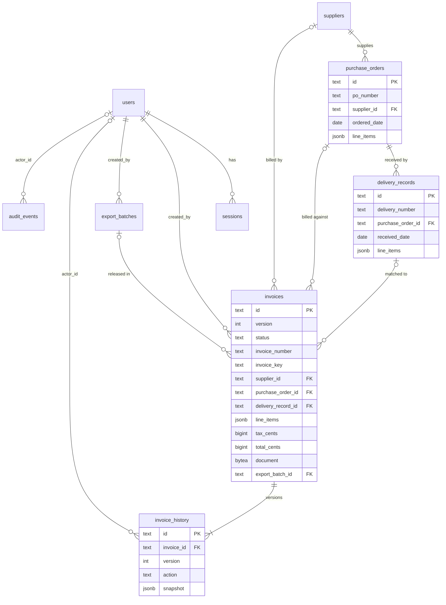

# 3. Domain model

> Part of the [Invoice Exception Assistant specification](./README.md). Applies to version **1.0.0**.

This document defines the entities the application manages, the exact limits on every field, and the
conventions used for identifiers, money, dates and text. The authoritative definitions are
[`src/domain/types.ts`](../src/domain/types.ts) (shapes),
[`src/domain/validation.ts`](../src/domain/validation.ts) (rules) and
[`server/migrations/001_initial.sql`](../server/migrations/001_initial.sql) (storage).
Table-level storage details are in [§6](./06-data-and-persistence.md).

## 3.1 Overview



In words:

- A **supplier** has many **purchase orders**; a purchase order has many **goods receipts**.
- An **invoice** optionally points at one supplier, one PO and one receipt (all three are *required for
  approval*, but a draft may be saved without them).
- Every change to an invoice appends one **history** row holding the full invoice **snapshot** for the new
  **version**.
- An approved invoice that is exported points at the **export batch** that released it.

## 3.2 Enumerations

### Invoice status

| Status | Meaning | Editable? |
| --- | --- | :---: |
| `needs_review` | Saved; evaluation found at least one exception that is not a duplicate (or the invoice was reopened) | ✔ |
| `possible_duplicate` | Saved; evaluation found a duplicate (takes precedence over other exceptions) | ✔ |
| `matched` | Saved; evaluation found **no** exceptions. Still needs a person to approve | ✔ |
| `correction_requested` | A reviewer recorded that a correction is needed (internal note only) | ✔ |
| `escalated` | A reviewer escalated it for internal review | ✔ |
| `ready_to_export` | Approved; waiting to be included in an export batch | ✘ (admin may *reopen*) |
| `exported` | Included in an export batch; **final** | ✘ |
| `voided` | Canceled with a reason; excluded from duplicate and reservation checks; **final** | ✘ |

The *editable* set is `needs_review`, `possible_duplicate`, `matched`, `correction_requested`, `escalated`
(`editableStatuses` in `validation.ts`). The status is a **label recorded at the last change**; whether an
invoice may be approved is decided by the *current* exceptions, not by the label
([§4.6](./04-matching-and-exceptions.md#46-status-derivation)).

### History action

`created`, `updated`, `approved`, `correction_requested`, `escalated`, `reopened`, `exported`, `voided`
(the `ReviewAction` type and a `CHECK` constraint on `invoice_history.action`).

### Other enumerations

| Name | Values |
| --- | --- |
| Role | `admin`, `reviewer` |
| Document MIME type | `application/pdf`, `image/png`, `image/jpeg` |
| Field provenance (`source`) | `manual`, `demo_extraction` |
| Exception type | `duplicate`, `price`, `quantity`, `field_confidence`, `missing_field` |
| Exception severity | `high`, `medium`, `low` (`low` is defined but no rule currently emits it) |
| Currency | `USD` only |
| Review decision (API) | `approved`, `correction_requested`, `escalated`, `reopened`, `voided` |

## 3.3 Users

| Field | Rules |
| --- | --- |
| `id` | UUID, server-generated |
| `email` | Valid e-mail, trimmed, **lower-cased**, ≤ 254 chars, unique (a `CHECK` enforces lower case) |
| `name` | 1–100 chars after normalization |
| `role` | `admin` or `reviewer` |
| `active` | `false` blocks sign-in and invalidates the account's sessions |
| `mustChangePassword` | `true` for accounts created in the UI and after any administrator or CLI password reset; `false` for accounts created by the CLI `create-admin` command and after the user changes their own password |
| password | 12–128 characters, not whitespace-only; stored only as a salted scrypt hash (never returned by the API) |

Users are **never deleted**; they can be disabled. History and audit rows keep the acting user's *name as it
was at the time* (`actor_name`) in addition to the foreign key, so renames or later disabling do not alter the
record of past actions.

## 3.4 Reference data

Reference data is created by administrators and is **immutable** once saved.

### Supplier

| Field | Rules |
| --- | --- |
| `id` | UUID |
| `name` | 1–160 chars |
| `code` | 1–40 chars; **unique, case-insensitively** |
| `location` | 0–160 chars (may be empty) |

### Purchase order

| Field | Rules |
| --- | --- |
| `id` | UUID |
| `poNumber` | 1–100 chars; unique, case-insensitively |
| `supplierId` | Must reference an existing supplier |
| `orderedDate` | Valid ISO date |
| `lineItems` | 1–100 lines `{ id, sku, description, quantity, unitPrice }`; SKUs unique within the PO; order total ≤ 100,000,000 |

### Goods receipt (`DeliveryRecord`)

| Field | Rules |
| --- | --- |
| `id` | UUID |
| `deliveryNumber` | 1–100 chars; unique, case-insensitively |
| `purchaseOrderId` | Must reference an existing PO |
| `receivedDate` | Valid ISO date, **not earlier than the PO's `orderedDate`** |
| `lineItems` | 1–100 lines `{ id, sku, description, quantity }` (no price); SKUs unique within the receipt |

Additional creation rules for receipts ([`catalog.ts`](../server/catalog.ts)): every SKU must exist on the PO,
and for each SKU the **cumulative received quantity across all receipts of that PO may not exceed the ordered
quantity** (`422 INVALID_RECEIPT`). Receipts count toward the PO whether or not any invoice references them.

## 3.5 Invoices

### Shape

| Field | Meaning and rules |
| --- | --- |
| `id` | UUID (the client's `requestId` for API-created invoices; `inv-001`… for seeded samples) |
| `version` | Integer ≥ 1; starts at 1; **+1 on every successful change** |
| `invoiceNumber` | ≤ 100 chars; whitespace runs collapsed to one space; may be empty in a draft |
| `supplierId` | `""` when unset, otherwise an existing supplier |
| `date`, `dueDate` | `""` when unset, otherwise a valid ISO date; `dueDate ≥ date` when both are set |
| `purchaseOrderId` | `""` when unset; must belong to the invoice's supplier |
| `deliveryRecordId` | Absent/`""` when unset; must belong to the invoice's PO |
| `currency` | Always `"USD"` |
| `lineItems` | 0–100 lines (see below) |
| `tax` | 0–10,000,000, ≤ 2 decimals |
| `status` | See [§3.2](#32-enumerations) |
| `extractedFields` | The four provenance fields (see below) |
| `sourceFile` | `{ name, type, size }` when a document is attached (the bytes are *not* part of this object) |
| `exportBatchId` | Set once exported |

Database-only columns: `invoice_key` (normalized duplicate key), `tax_cents`, `total_cents`, `created_by`,
`request_fingerprint` (idempotency), `created_at`, `updated_at`, and the `document` bytes.

### Invoice line

| Field | Rules |
| --- | --- |
| `id` | Server-generated UUID. **Regenerated every time the invoice is saved**, so line IDs (and therefore rule-evidence IDs derived from them) are stable only within one version |
| `sku` | 1–80 chars, normalized, **upper-cased** |
| `description` | 1–250 chars |
| `quantity` | Integer 1–1,000,000 |
| `unitPrice` | 0–10,000,000, ≤ 2 decimals |

SKUs must be unique within an invoice (compared after upper-casing).

### Field provenance (`extractedFields`)

Four entries are generated on every save from the values the user typed: **Invoice number**, **Supplier**
(the supplier's *name*), **Invoice date** and **Total** (a formatted currency string, or empty when there
are no lines). Each has `source: "manual"` and **no confidence**. The `demo_extraction` source and per-field
`confidence` values exist only in the synthetic sample dataset, to exercise the low-confidence rule. Because
these fields are regenerated from the typed values, an empty invoice number, supplier, date or total also
produces a "missing field" exception ([§4.3](./04-matching-and-exceptions.md#43-rule-catalog)).

### Validation rules (consolidated)

| Input | Rule |
| --- | --- |
| Free text (`invoiceNumber`, `sku`, `description`, names, notes) | Unicode **NFKC** normalized, trimmed, length-limited, and **control characters (U+0000–U+001F, U+007F) rejected** |
| Identifier references | `""` or `^[a-zA-Z0-9-]{1,80}$` |
| Dates | Strict ISO calendar date `YYYY-MM-DD` (leap years honored) |
| Money | Finite number, 0–10,000,000, at most two decimal places |
| Quantity | Integer 1–1,000,000 |
| Lines per document | ≤ 100 |
| Invoice total | `subtotal + tax` ≤ **100,000,000** |
| Unknown properties | **Rejected** (every body schema is `strict`) |
| Review/edit note | ≤ 1,000 chars; required (≥ 1) when editing and for every decision except approval |
| Document | 12 bytes – 10 MiB; real type PDF/PNG/JPEG; declared MIME type and file extension must agree |
| Page size | 1–100 (default 25); page 1–100,000; search text ≤ 100 chars |

## 3.6 History, audit and export records

### Invoice history (`ReviewHistory`)

One row per invoice version. Fields: `id`, `invoiceId`, `invoiceNumber` (joined, for display), `version`,
`action`, `user` (actor name at the time), `timestamp`, `detail` (human-readable sentence), and — on the
per-invoice endpoint — `snapshot` (the complete `Invoice` as of that version, including line items, status and
field provenance, but not the document bytes). `(invoice_id, version)` is unique.

### Administrative audit event (`AuditEvent`)

For things that are not part of one invoice's story: `id`, `action`, `entityId`, `user`, `detail`,
`timestamp`. Vocabulary:

| `action` | Raised when |
| --- | --- |
| `admin_bootstrapped` | The CLI created an administrator (actor "Operator CLI") |
| `user_created` | An administrator created an account |
| `user_updated` | An administrator changed role/enabled state |
| `password_reset` | An administrator or the CLI set a temporary password |
| `password_changed` | A user changed their own password |
| `supplier_created`, `purchase_order_created`, `delivery_created` | Reference data created |
| `export_created` | An export batch was committed |
| `demo_seeded` | Development sample data was loaded |

### Export batch (`ExportBatch`)

`id` (the client's request ID), `createdAt`, `createdBy` (user name), `invoiceCount`. Stored additionally:
the **sorted request** (invoice IDs and versions), the ordered list of invoice IDs, and the **exact CSV
text**. Format: [§5.6](./05-invoice-lifecycle.md#56-export-batches).

## 3.7 Internal records

Not exposed as business entities:

- **Session** – `token_hash` (SHA-256 of the random cookie token; the token itself is never stored), `user_id`,
  `csrf_token`, `expires_at`, `created_at`.
- **Rate-limit counter** – `key` (SHA-256 of a limiter key such as `login-ip:1.2.3.4`), `attempts`, `reset_at`.
  Keys never store raw IPs or e-mail addresses.

## 3.8 Identifiers

| Kind | Format | Source |
| --- | --- | --- |
| Users, suppliers, POs, receipts, history, audit, line items | Random UUID v4 | Server (`crypto.randomUUID()`) |
| Invoice | UUID | **Client `requestId`** at creation (this is the idempotency key); seeded samples use `inv-001`… |
| Export batch | UUID | **Client `requestId`** at export creation |
| Path/query/body references | Must match `^[a-zA-Z0-9-]{1,80}$` | Validated on input |

IDs are opaque; nothing should be inferred from their format.

## 3.9 Money

- **Currency:** USD. A database `CHECK` and the `Invoice.currency` type both pin it.
- **Arithmetic is in integer cents** ([`src/domain/money.ts`](../src/domain/money.ts)):

  ```text
  lineTotal  = quantity × round(unitPrice × 100) / 100
  subtotal   = Σ lineTotal
  total      = ( round(subtotal × 100) + round(tax × 100) ) / 100
  ```

  Converting to cents with `Math.round` first means `0.1 × 3` is exactly `0.30`, never `0.30000000000000004`.
- **Storage:** line prices are JSON numbers inside `line_items`; `tax_cents` and `total_cents` are `bigint`
  columns, bounded by `CHECK` constraints (tax ≤ 10 million dollars, total ≤ 100 million dollars).
- **Tolerance comparison** is done on cents (`invoiceCents × 100 ≤ orderCents × 105`), not on rounded
  percentages ([§4.4](./04-matching-and-exceptions.md#44-precise-definitions)).
- **Display:** `Intl.NumberFormat("en-US", { style: "currency", currency: "USD" })`.
- **CSV:** totals are written with `toFixed(2)` and no currency symbol or thousands separator.

## 3.10 Dates, time and text normalization

- **Business dates** (`date`, `dueDate`, `orderedDate`, `receivedDate`) are `YYYY-MM-DD` strings in JSON and
  PostgreSQL `date` columns; the driver is configured to return them as strings, so **no time-zone conversion
  can shift a date**.
- **Event timestamps** are `timestamptz` and are serialized as UTC ISO-8601 with milliseconds
  (e.g. `2026-10-02T06:47:45.123Z`). The browser formats them with the viewer's locale.
- **Text** is NFKC-normalized and trimmed on input; control characters are rejected.
- **Invoice number** additionally has internal whitespace collapsed.
- **Duplicate key:** `normalizedInvoiceNumber(x) = NFKC(x).trim().replace(/\s+/g, " ").toLowerCase()`,
  computed in application code and stored in `invoice_key`. It is deliberately **not** computed with SQL
  `lower()`, so duplicate detection does not depend on the database's locale/collation (an integration test
  covers a Unicode case-folding edge case).
- **SKU** is upper-cased on input, so comparisons are case-insensitive by construction.

## 3.11 Stored versus derived data, immutability and deletion

| Data | Stored? | Notes |
| --- | :---: | --- |
| Invoice fields, status, version | ✔ | `status` is the label at the last change |
| **Exceptions / evidence** | ✘ | Recomputed on demand from current data; never persisted |
| Exception count/reason in the queue, dashboard counts | ✘ | Computed per request (counts by stored `status`; exception text by live rules) |
| History snapshots | ✔ | Full invoice per version |
| CSV for an export | ✔ | Exact text, so it can be re-downloaded |
| Document bytes | ✔ | In `invoices.document` |

| Table | Mutability |
| --- | --- |
| `suppliers`, `purchase_orders`, `delivery_records` | **Insert-only** (trigger blocks `UPDATE`/`DELETE`; runtime role has no such privilege) |
| `invoice_history`, `audit_events`, `export_batches` | **Insert-only** (same) |
| `invoices` | Updated only through versioned workflows; the runtime role has **no `DELETE`** privilege |
| `users` | Insert + update; the runtime role has **no `DELETE`** privilege |
| `sessions`, `rate_limits` | Insert/update/**delete** (ephemeral; expired rows are purged hourly) |

There is **no deletion or purge workflow** for finance data. Voiding hides an invoice from checks but keeps
it. Define retention, archival and any privacy-erasure procedure before collecting regulated personal data
([§13](./13-limitations-and-roadmap.md)).

## 3.12 Sample dataset

[`src/data/demoData.ts`](../src/data/demoData.ts) holds a small **synthetic** dataset: 5 suppliers, 6 purchase
orders, 6 goods receipts and 7 invoices, plus 4 sample history entries that only the UI test fixtures use.
`npm run db:seed` loads the suppliers, orders, receipts and invoices into an **empty development** database and
writes **one generated history row per invoice** (action `approved` for the ready-to-export invoice, `created`
for the rest, detail "Synthetic example loaded by the explicit development seed command.") plus a `demo_seeded`
audit event; the 4 sample history entries are *not* loaded. The dataset also serves as the fixture for most
automated tests. It is **never** loaded automatically, and the seed command refuses to run when
`NODE_ENV=production` or when any supplier or invoice already exists.

Each invoice demonstrates one situation. The "Exceptions found" column is the **actual output** of the rule
engine on the sample data (captured 2026-10-02):

| Invoice | Supplier | PO / receipt | Total | Seeded status | Exceptions found |
| --- | --- | --- | ---: | --- | --- |
| `inv-001` NFM-24081 | Northstar Fasteners | PO-10482 / GRN-7281 | 524.88 | `matched` | none — a clean three-way match |
| `inv-002` ALP-8837 | Alpine Industrial Supply | PO-10491 / GRN-7290 | 135.00 | `needs_review` | **price**: 13.50 vs PO 12.00 = +12.5 % (difference $15.00) |
| `inv-003` PAC-11029 | Pacific Safety Co. | PO-10495 / GRN-7294 | 317.52 | `needs_review` | **quantity**: 30 invoiced − 24 delivered = 6 unreceived |
| `inv-004` MER-55210 | Meridian Lubricants | PO-10502 / GRN-7301 | 552.96 | `possible_duplicate` | **duplicate** of `inv-005` |
| `inv-005` MER-55210 | Meridian Lubricants | PO-10502 / GRN-7301 | 552.96 | `possible_duplicate` | **duplicate** of `inv-004` |
| `inv-006` ECO-9014 | EcoPack Solutions | PO-10509 / GRN-7308 | 248.40 | `needs_review` | **confidence**: Supplier field 61 % < 80 %; **missing** field: Total |
| `inv-007` NFM-24096 | Northstar Fasteners | PO-10518 / GRN-7312 | 64.80 | `ready_to_export` | none — already approved, ready for an export batch |

Reference data in the sample: suppliers `sup-001`…`sup-005` (codes NSF-014, AIS-208, PSC-091, MRL-156,
EPS-044); POs `po-001`…`po-006` (PO-10482 … PO-10518); receipts `del-001`…`del-006` (GRN-7281 … GRN-7312).
Note that `inv-004` and `inv-005` both draw on the same 8 units of PO-10502 and receipt GRN-7301. While one
of them is approved or exported it holds those units, so the other cannot be approved even if its duplicate
flag is cleared by renumbering; only voiding the other, or reopening and voiding the first, frees them
(an *exported* invoice consumes its units permanently). See
[§4.5](./04-matching-and-exceptions.md#45-worked-examples).
