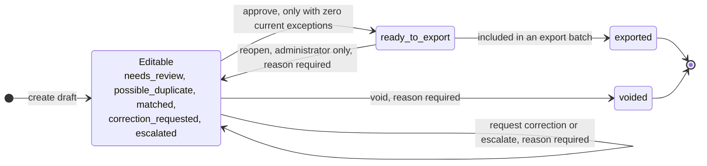
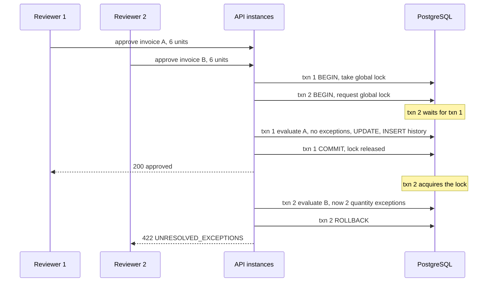
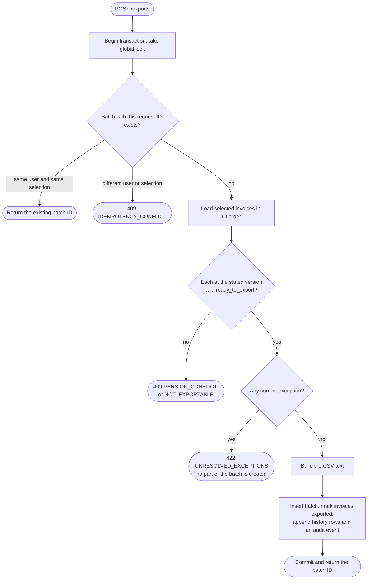

# 5. Invoice lifecycle and workflows

> Part of the [Invoice Exception Assistant specification](./README.md). Applies to version **1.0.0**.

This document defines how an invoice moves from draft to export, what protects those moves, how concurrent
and repeated requests are handled, and how the same ideas apply to export batches and user accounts. The
implementation is in [`server/invoices.ts`](../server/invoices.ts), [`server/accounts.ts`](../server/accounts.ts)
and [`server/database.ts`](../server/database.ts).

## 5.1 The lifecycle at a glance



- **Editable** invoices can be edited, corrected, escalated, approved or voided.
- **`ready_to_export`** invoices are locked except that an **administrator** may *reopen* them (the invoice
  returns to `needs_review`).
- **`exported`** and **`voided`** are final. They can never be edited, reopened, un-voided, or deleted.

## 5.2 Transitions in detail

| Action | Endpoint | Allowed from | Who | Requires | Result | History `action` and detail |
| --- | --- | --- | --- | --- | --- | --- |
| **Create** | `POST /invoices` | – | any user | Valid input; consistent references; optional document | `needs_review`, `possible_duplicate` or `matched` (derived, [§4.6](./04-matching-and-exceptions.md#46-status-derivation)) | `created` — "Draft created for manual review. OCR is not configured." |
| **Save fields** | `PUT /invoices/:id` | editable | any user | Current `version`; full invoice input; **note** (1–1000 chars) | derived status; version + 1 | `updated` — "Fields verified and updated: *note*" |
| **Approve** | `POST /invoices/:id/review` | editable | any user | Current `version`; **zero current exceptions** | `ready_to_export` | `approved` — "Approved for CSV export." (+ " Reason: *note*" if given) |
| **Request correction** | same | editable | any user | Current `version`; **note** | `correction_requested` | `correction_requested` — "Correction requested internally; no supplier message was sent." + reason |
| **Escalate** | same | editable | any user | Current `version`; **note** | `escalated` | `escalated` — "Escalated for internal review." + reason |
| **Void** | same | editable | any user | Current `version`; **note** | `voided` | `voided` — "Invoice voided; it no longer blocks duplicate checks." + reason |
| **Reopen** | same | `ready_to_export` only | **administrator** | Current `version`; **note** | `needs_review` | `reopened` — "Approval revoked; invoice reopened for review." + reason |
| **Export** | `POST /exports` | `ready_to_export` | any user | Current `version` of each invoice; still zero exceptions | `exported`; `exportBatchId` set | `exported` — "Included in CSV export *batch-id*. No ERP or payment system was contacted." |

Notes:

- The *order of checks* in a decision is: the request body is validated (400) → inside the write transaction the
  actor must still be active (401) and past the temporary-password gate (403), and for **`reopened`** the
  **administrator role** is enforced (403) — *before* the invoice is even looked up, so a reviewer attempting a
  reopen gets 403 even for an invoice that does not exist → invoice exists (404) → **version** matches (409
  `VERSION_CONFLICT`) → **state** allows the action (409 `INVALID_TRANSITION`) → for approval, **no exceptions**
  (422 `UNRESOLVED_EXCEPTIONS`). A stale request is therefore reported as a version conflict even if the
  invoice has since become locked.
- Each successful action performs, in **one transaction**: the invoice update, the new history row (with full
  snapshot), and — for exports — the batch row and audit event.
- *Correction requested*, *escalated* and *reopened* do not stop an invoice being edited or approved later;
  they are status labels plus a recorded reason.
- A **voided** invoice cannot be revived. Create a new invoice instead.
- **Approval does not need a note**; every other decision does. A note on approval is optional and, if given,
  is appended to the history detail.

## 5.3 Versioning and optimistic concurrency

Every invoice has an integer `version`, starting at 1. Every successful change — create, save, any decision,
and export — increments it by one and writes **exactly one** history row for that new version
(`UNIQUE (invoice_id, version)`).

Every write request states the version it was *based on*:

| Request | Where the version goes |
| --- | --- |
| Save fields, decisions | `version` in the JSON body |
| Export | `version` next to each invoice ID |

If the stored version is different, the request fails with **409 `VERSION_CONFLICT`** ("Another user changed
this invoice. Reload it before continuing.") and **nothing is written** — in particular, no history row. This is
*optimistic* concurrency: nobody holds an edit lock; the loser of a race is told, instead of silently
overwriting or being overwritten.

In the UI, the error is shown at the point of action. A failed edit **keeps the user's typed values** so they
can copy them; "Discard edits and reload latest version" fetches the current invoice. The Exports page's
*Clear selection and reload* does the same for stale export selections.

## 5.4 Idempotency

Two operations create new records and are safe to retry after an uncertain network failure:

| Operation | Key | Server behavior |
| --- | --- | --- |
| **Create invoice** | `requestId` (UUID) — **becomes the invoice's ID** | If an invoice with that ID exists, the same user and an identical **fingerprint** → return the existing invoice (`201 {id}` again). Different user or different content → `409 IDEMPOTENCY_CONFLICT`. |
| **Create export** | `requestId` (UUID) — **becomes the batch ID** | If a batch with that ID exists, same user and same selection (compared after sorting by invoice ID, so selection order does not matter) → return the existing batch. Otherwise `409 IDEMPOTENCY_CONFLICT`. |

The invoice **fingerprint** is `SHA-256( JSON({ invoice, document name, document type, SHA-256(document bytes) }) )`
of the *parsed* input. The check happens inside the global lock, so two simultaneous identical requests cannot
both insert.

How the UI uses this:

- The **New invoice** screen keeps one `requestId` while the form content and attached file are unchanged and
  generates a new one when either changes. Retrying a failed save therefore cannot create a duplicate.
- The **Exports** screen keeps one `requestId` for a given selection and clears it when the selection changes
  or the batch succeeds.

Edits and decisions are not idempotent keys; they are protected by the version check (a replayed edit whose
version is now stale fails with 409 instead of applying twice).

## 5.5 Concurrency control

### The global workflow lock

Every business write is wrapped by `workflow()` ([`database.ts`](../server/database.ts)):

```text
BEGIN
SELECT pg_advisory_xact_lock(20261002, 1)          -- one team-wide lock
SELECT active, role, must_change_password
  FROM users WHERE id = <actor> FOR SHARE          -- re-check the actor from the database
  (reject: inactive → 401, must change password → 403, admin required but not admin → 403)
… the operation …
COMMIT                                             -- or ROLLBACK; the lock is released either way
```

Why one lock for everything? The invariants that matter cross rows: duplicate detection (invoice vs. other
invoices), quantity reservation (invoice vs. PO/receipt vs. other invoices), export (many invoices at once),
and the account rules (the last-administrator guard). One transaction-scoped advisory lock makes all of them
trivially correct, **across any number of API processes**, with no deadlock risk between lock orderings.



The test "serializes concurrent approvals to prevent cumulative overbilling" fires two approvals at once
and asserts exactly one `200` and one `422`.

### Lock namespaces

All advisory locks use the key space `20261002`:

| Second key | Used by |
| ---: | --- |
| `0` | Migration runner |
| `1` | Business writes (`workflow()`), password change, and the CLI's `create-admin` / `reset-password` |
| `2` | Runtime-role provisioning |

### Other locking

- User rows touched by administration are read `FOR UPDATE` (account changes) or `FOR SHARE` (sign-in and the
  per-transaction actor check).
- **Not locked:** read endpoints, session lookups, rate-limit counters. Reads run on separate pooled
  connections without a shared snapshot, so a response assembled from several queries (for example an
  invoice plus its history count) may reflect a write that landed between them. Writes are unaffected: they
  re-read everything under the lock.

### Waiting and timeouts

A request waits for the lock as a normal SQL statement, so the pool's **15-second `statement_timeout`**
bounds the wait. A request that cannot get the lock in time fails with a generic `500 INTERNAL_ERROR` and
rolls back; nothing is partially applied, and the retry rules above make it safe to try again. The pool holds
at most **10** connections, each held while waiting; a 5-second connection timeout applies to new requests
when all are busy. The design favors correctness over write throughput and suits a small team. See
[§12.5](./12-operations.md#125-capacity-and-scaling).

Password changes also take the lock and hash passwords while holding it, so a password change briefly
delays other writes (account creation and administrator resets hash *before* taking the lock).

## 5.6 Export batches



**Selection rules.** 1–500 distinct invoices, each with the version the user saw; every one must be
`ready_to_export`. Exceptions are re-checked for the *whole* selection at export time, so an invoice approved
yesterday is rejected today if, for example, a duplicate has since appeared.

**What is stored** (table `export_batches`): batch ID, creator, creation time, the sorted request, the ordered
invoice IDs, and the **exact CSV text**. The table is insert-only. Each included invoice becomes `exported`
and gets a history row; one `export_created` audit event is written.

**CSV format** ([`src/utils/csv.ts`](../src/utils/csv.ts)):

```text
Invoice number,Supplier,Invoice date,Currency,Total,Purchase order,Status
NFM-24096,Northstar Fasteners,2026-09-25,USD,64.80,PO-10518,Ready to export
```

- Rows are separated by **CRLF** with **no trailing newline**; the stored text has no byte-order mark. The
  **download** prepends a UTF-8 BOM (`EF BB BF`) so spreadsheets open it correctly.
- Rows follow **invoice-ID order**, not date or invoice number.
- `Total` is `toFixed(2)` of the invoice total; `Currency` is `USD`; `Status` is the constant `Ready to export`
  (it describes the state at hand-off).
- **Spreadsheet-formula protection:** any value starting (after optional whitespace/control characters) with
  `=`, `+`, `-` or `@`, or starting with a tab/CR/LF, is prefixed with an apostrophe. Values containing a
  comma, double quote, CR or LF are quoted with `"` doubled. Downstream importers should treat every column
  as text.
- A missing supplier or PO reference makes generation fail rather than write a blank cell.

**Recovery.** `GET /exports/:id/download` returns the stored CSV any time, so a failed or lost download is
retried from **Export history** — never by exporting again. The UI distinguishes "the batch could not be
created" from "the batch was saved but the download failed".

**What "exported" means.** Only that a batch exists and the invoice is locked. The application cannot know
whether another system imported the file; reconcile in your finance process and keep the batch ID.

## 5.7 Account lifecycle

Accounts have two flags — `active` and `must_change_password` — and one role.

| Operation | By | Effect | Sessions | Audit event |
| --- | --- | --- | --- | --- |
| Create (UI) | administrator | `active = true`, `must_change_password = true` | – | `user_created` |
| Bootstrap administrator (CLI) | operator | `active = true`, `must_change_password = false` | – | `admin_bootstrapped` |
| First sign-in | user | Session works only for `/auth/*`; all other endpoints return `403 PASSWORD_CHANGE_REQUIRED` and the UI shows only the change-password form | – | – |
| Change own password | user | New hash; `must_change_password = false` | **All** of the user's sessions deleted; a new one is issued to this browser | `password_changed` |
| Set temporary password (UI) | administrator (not for themselves) | New hash; `must_change_password = true` | Target's sessions deleted | `password_reset` |
| Reset password (CLI) | operator | Same; works for any existing account; **does not re-enable** a disabled account | Target's sessions deleted | `password_reset` (actor "Operator CLI") |
| Disable / re-enable | administrator (not themselves) | `active` toggled | Target's sessions deleted | `user_updated` |
| Change role | administrator (not themselves) | `role` changed | Target's sessions deleted | `user_updated` |

Guards: an administrator cannot change their own role/enabled state or set their own temporary password
(`409 SELF_MANAGEMENT_BLOCKED`); a "last active administrator" guard (`409 LAST_ADMIN`) exists as defense in
depth but cannot normally trigger, because the acting administrator is always an active administrator who is
excluded from the change. Duplicate e-mail → `409 ALREADY_EXISTS`.

## 5.8 History and audit trail

| Record | Scope | Written when | Contains | Visible to |
| --- | --- | --- | --- | --- |
| **Invoice history** (`invoice_history`) | One invoice | Every create, save, decision, export | version, action, actor (id + name at the time), detail, **full snapshot** | All users, on the invoice page; newest first; paginated |
| **Audit event** (`audit_events`) | Whole workspace | Account changes, reference-data creation, exports, bootstrap, seed | action, entity ID, actor, detail | **Administrators**, on *Team access* |

Both tables are insert-only (triggers + no `UPDATE`/`DELETE` privilege for the runtime role). A snapshot lets
anyone reconstruct *exactly* what an approver saw at that version. Snapshots do not include document bytes
(only name/type/size) and are not cryptographically chained; an owner-level database user could still alter
them ([§8.13](./08-security.md#813-known-gaps-and-residual-risks)).

## 5.9 System invariants

These are the guarantees the system is built to uphold, where each is enforced, and the automated test that
demonstrates it. (Test names are quoted from the suites in [`tests/`](../tests) and `src/`; see
[§11](./11-testing-and-quality.md).)

| ID | Invariant | Enforced by | Demonstrated by |
| --- | --- | --- | --- |
| **INV-01** | An invoice with any current exception is never approved | `reviewInvoice` re-evaluates inside the lock | "blocks every existing exception on %s"; "supports incomplete drafts but never approves one" |
| **INV-02** | An invoice with any current exception is never exported; a failed export changes nothing | `createExport` re-evaluates all invoices; one transaction | "rechecks approvals at export time when a new duplicate arrives" |
| **INV-03** | Exported and voided invoices are final; approved ones change only by admin reopen | `checkEditable`, reopen rule | "creates exactly-once, recoverable CSV export batches and locks invoices"; "resolves duplicates by voiding the incorrect record, not hiding its audit trail"; "allows only explicit admin reopen for approved invoices" |
| **INV-04** | A stale version never applies and leaves no history | `checkVersion` before any write | "rejects stale versions without adding history" |
| **INV-05** | Reasons are mandatory for edits and every decision except approval | `updateInvoiceSchema`, `reviewSchema` | "requires reasons and records real reviewers for correction and escalation"; validation unit tests |
| **INV-06** | Every version has exactly one immutable history row with a full snapshot | `UNIQUE(invoice_id, version)`, triggers, same transaction | "returns paginated, immutable history and missing-record errors"; "edits and verifies draft fields before approval, preserving audit snapshots" |
| **INV-07** | Concurrent approvals cannot reserve the same quantity twice | Global advisory lock | "serializes concurrent approvals to prevent cumulative overbilling" |
| **INV-08** | Creating an invoice or export is idempotent; a reused key with different content is rejected | Request ID as primary key + fingerprint | "makes draft creation safely retryable without duplicating records"; "rejects a cross-account idempotency replay and preserves incomplete fields"; "creates exactly-once, recoverable CSV export batches and locks invoices" |
| **INV-09** | Reference data, history, audit and export batches cannot be altered or deleted | Triggers + privilege separation | "supports creating suppliers, POs and receipts without demo data" (trigger error); "cannot delete finance records, rewrite audit trails, or change schemas" |
| **INV-10** | Receipts cannot exceed the PO's remaining quantity or predate the order | `createDelivery` | "supports creating suppliers, POs and receipts without demo data" |
| **INV-11** | Reviewers cannot administer accounts or reference data, or reopen invoices | `requireAdmin` + role re-check in `workflow()` | "prevents reviewers from administering accounts or reference data" |
| **INV-12** | No business access until a temporary password is replaced | Gate in the `/api` router + `workflow()` | "creates temporary-password accounts and requires password rotation" |
| **INV-13** | Disabled, demoted or reset users lose access immediately | Session query requires `active`; sessions deleted; role re-read per transaction | "enforces expiry and current active-account state"; "revokes sessions on account changes and password reset"; "rejects removed accounts and invalid session cookies" |
| **INV-14** | Administrators cannot lock themselves out or demote themselves | `SELF_MANAGEMENT_BLOCKED` | "prevents self-disable and returns a conflict for duplicate accounts" |
| **INV-15** | Mutations come only from the configured origin and carry the session's CSRF token | Origin check + `requireCsrf` | "rejects cross-origin mutations, including login"; "rejects missing or invalid CSRF headers (%s)" |
| **INV-16** | Sessions are opaque, HttpOnly, and revocable; login does not reveal whether an account exists | Cookie settings; hashed tokens; dummy hash | "uses opaque HttpOnly sessions, shared state, and explicit logout"; "does not reveal whether an account exists or is disabled" |
| **INV-17** | Uploaded documents are validated by content, type, extension and size, and are downloadable only as attachments by signed-in users | `validateDocument`; download headers | "persists uploaded documents and serves authenticated attachment downloads"; "rejects empty, mislabeled, oversized, and malformed uploads" |
| **INV-18** | The running application cannot change the schema or delete finance data | Limited database role | "cannot delete finance records, rewrite audit trails, or change schemas" |
| **INV-19** | A schema that does not match the code is detected before serving traffic | Checksummed migration ledger | "masks unexpected database errors and detects unapplied migrations" |
| **INV-20** | Money is exact to the cent | Integer-cent arithmetic; schema limits | `money.test.ts`; `validation.test.ts`; `invoiceChecks.test.ts` boundary tests |
