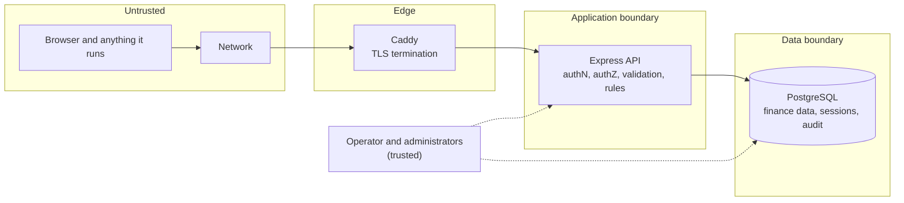

# 8. Security

> Part of the [Invoice Exception Assistant specification](./README.md). Applies to version **1.0.0**.

This document describes the security model: what is protected, the controls that protect it, how each control
was verified, and — just as importantly — what is **not** protected. It is written for developers, operators and
reviewers. It is a description of the implementation, **not** a penetration-test report or compliance
certification.

## 8.1 Objectives and assumptions

**Objectives**

1. Only people an administrator has admitted can see or change finance data.
2. Nobody can approve or export an invoice that violates the rules, or alter the evidence of what was approved.
3. A compromised browser tab, a hostile web page, or a malicious upload cannot act on a user's behalf or
   attack other users.
4. A compromised application process cannot erase or rewrite finance evidence.
5. Failures reveal nothing useful to an attacker.

**Assumptions** (the design depends on these being true)

- The deployment serves **one trusted finance team**; all active users may see all data.
- Production traffic is **HTTPS** end to end from the browser to the proxy, and the API is reachable *only*
  through the proxy.
- The database is private and its credentials are protected.
- Administrators and the host/Docker operator are trusted.
- Users keep their own devices reasonably secure.

## 8.2 Assets, actors and trust boundaries

| Asset | Why it matters | Primary protections |
| --- | --- | --- |
| Account credentials and sessions | Gate everything | scrypt hashing, hashed opaque session tokens, cookie flags, rate limits |
| Invoices, documents, exports | Financial and possibly personal data | Authentication, role checks, private database, no third-party sharing |
| Approval decisions and audit trail | Accountability | Immutability triggers, privilege separation, versioned snapshots |
| Secrets (database passwords) | Full data access | Env-only, separate roles, never in images/logs |

## 8.3 Authentication and passwords

- **Accounts** are created only by an administrator or by the operator CLI. There is no self-registration or
  e-mail-based recovery.
- **Password policy:** 12–128 characters, not whitespace-only. Length-only by design (no composition rules);
  there is no breached-password check, history, or expiry.
- **Hashing:** Node's `crypto.scrypt` with **N = 32768 (2¹⁵), r = 8, p = 3**, a 64-byte key and a fresh random
  16-byte salt per password. This is one of the equivalent scrypt parameter sets recommended by OWASP.
  Stored as `scrypt-32768-8-3$<salt-hex>$<hash-hex>`; verification accepts only that exact prefix and compares
  with `timingSafeEqual`. A future parameter change needs a new prefix plus a rehash-on-login migration (not
  yet implemented).
- **Login flow** ([`app.ts`](../server/app.ts)): validate body → count against the IP and account limiters →
  look up the account → **always verify a password** (against a startup-generated dummy hash when the e-mail is
  unknown) → reject unknown, wrong-password and disabled accounts with the *same* message and status → re-check
  the account inside a transaction (`FOR SHARE`) → create the session and clear the account's failure counter.
  Response content and timing therefore do not reveal whether an e-mail exists.
- **Rate limits:** 30 attempts per IP and 10 per submitted e-mail per 15 minutes
  ([§7.3](./07-api-reference.md#73-limits)). Counters are shared across API instances.
- **Temporary passwords:** accounts created in the UI, and accounts after an administrator/CLI reset, must
  change their password before any business endpoint works ([§5.7](./05-invoice-lifecycle.md#57-account-lifecycle)).
- **Changing a password** requires the current one, rejects reuse, deletes **all** the user's sessions, and
  issues a new one.
- **Not provided:** MFA, SSO/OIDC, passkeys, account lockout (throttling only), password expiry.

## 8.4 Sessions, cookies and CSRF

### Sessions

| Property | Value |
| --- | --- |
| Token | 32 random bytes, hex (64 chars), generated server-side at login |
| At rest | **Only the SHA-256 hash** is stored; a database leak does not yield usable tokens |
| Format check | The cookie must match `^[a-f0-9]{64}$` before any database lookup |
| Lifetime | **Absolute**, `SESSION_HOURS` (default 8, range 1–24); activity does not extend it |
| Validity test | On *every* request: token hash exists, not expired, **and the user is currently active** |
| Revocation | Logout; password change; administrator disable / role change / password reset; hourly purge of expired rows |
| Fixation | Not possible — the browser never supplies a pre-login session identifier; each login creates a new token |
| Concurrency | Several sessions per user are allowed; **login does not revoke earlier ones** |

### Cookie (verified against a running server)

| | Development / test | Production |
| --- | --- | --- |
| Name | `invoice_session` | `__Host-invoice_session` |
| Attributes | `HttpOnly; SameSite=Strict; Path=/; Max-Age=28800` | `HttpOnly; Secure; SameSite=Strict; Path=/; Max-Age=28800` |

The `__Host-` prefix makes browsers require `Secure`, `Path=/` and no `Domain`, so the cookie is host-only and
cannot be set by a sibling subdomain. `HttpOnly` keeps it away from scripts.

### CSRF and cross-origin requests — three independent layers

1. **`SameSite=Strict`** — the browser does not attach the cookie to cross-site requests.
2. **Exact `Origin` check** — every unsafe request (including login) must carry `Origin` exactly equal to
   `APP_ORIGIN`; a missing or different value is `403 ORIGIN_REJECTED`. Non-browser clients must send it.
3. **Synchronizer token** — every unsafe authenticated request must send `X-CSRF-Token` equal to the
   session's token (format-checked, then compared with `timingSafeEqual`). The browser keeps the token **in
   memory only** (a React ref) — never in cookies, `localStorage` or `sessionStorage`.

No CORS headers are emitted, so other origins cannot read API responses either.

## 8.5 Authorization

Two roles; **all checks are on the server**. The UI hides administrator navigation as a convenience only.

| Requirement | Enforced by |
| --- | --- |
| Any signed-in, password-verified user | `requireSession`, then the temporary-password gate |
| **Administrator** for reference-data creation and every `/admin/*` route | `requireAdmin` middleware **and** `workflow(…, admin = true)`, which re-reads the actor's *current* role and active flag from the database inside the write transaction |
| **Administrator** to reopen an approved invoice | `workflow(…, admin = action === "reopened")` |
| Not acting on yourself (role, enabled state, temporary password) | `SELF_MANAGEMENT_BLOCKED` in `accounts.ts` |

Properties:

- **Immediate effect.** Because the role/active flag is re-read inside each write and the session query
  requires an active user, a disabled or demoted user loses write access on their very next request.
- **No per-record permissions.** Any active user can read any invoice, document or export, and a reviewer may
  approve an invoice they created. These are deliberate scope limits ([§1.4](./01-product-overview.md#14-users-and-roles)).
- **Reads are not role-filtered**, except the administrator-only routes above.

## 8.6 Input validation and injection defenses

- **Schema-first.** Every body, query and path parameter is parsed with a strict Zod schema *before* any logic
  runs; unknown keys are rejected; lengths, ranges and formats are bounded ([§3.5](./03-domain-model.md#35-invoices)).
  Text is NFKC-normalized and control characters are rejected.
- **SQL injection.** All values are bound parameters. The only interpolated SQL is (a) a fixed internal map of
  table/column names for the three reference lists and (b) a hard-coded `ORDER BY` fragment chosen from a
  four-value enum. `LIKE` wildcards in search text are escaped.
- **XSS.** React escapes all rendered values; the code base contains **no** `dangerouslySetInnerHTML`,
  `innerHTML` or `eval`. Snapshots are shown as escaped text in a `<pre>`. A strict CSP (below) is the second line.
- **Path traversal.** Document names are metadata only; **nothing is ever written to or read from the file
  system by name** (documents live in the database).
- **Mass assignment.** Request schemas list the writable fields explicitly. Status, version, actor, currency,
  provenance and IDs are set by the server and cannot be supplied by a client (tests post forged values and
  expect `400`).
- **Resource limits.** JSON 128 KiB; one 10 MiB document; 100 lines; 500 export items; 100-row pages;
  request/header timeouts; 10-connection database pool; 15 s statement timeout.

## 8.7 Documents (upload and download)

**Upload checks** (`validateDocument`): size ≥ 12 bytes and ≤ 10 MiB; the **real type is detected from the
bytes** (`file-type`) and must be PDF, PNG or JPEG; the multipart-declared MIME type must equal the detected
type; the sanitized filename's extension must match the detected type (`.pdf`; `.png`; `.jpg`/`.jpeg`).
Filenames are reduced to their base name (both `/` and `\`), NFKC-normalized, stripped of control characters and
capped at 200 characters. Truncated files are rejected.

**Storage:** the bytes go into PostgreSQL inside the creating transaction; nothing touches the disk.

**Download** (verified): `Content-Disposition: attachment`, the stored `Content-Type`, `X-Content-Type-Options:
nosniff`, `Cache-Control: no-store`, and `Content-Security-Policy: sandbox; default-src 'none'`. The browser is
told to *save* the file, never to render it in the application's origin. The UI never embeds a stored document.
Only a not-yet-uploaded **image** chosen on the intake screen is previewed, from a local `blob:` URL that is
revoked afterwards.

**Not provided:** antivirus/malware scanning, content disarm and reconstruction, or sanitizing of PDF/image
internals. Signature checks stop mislabeled files, not malicious files that are genuinely PDFs or images.
Restrict upload to trusted staff, and scan before opening documents from untrusted senders.

## 8.8 Spreadsheet (CSV) injection

Exported text that a spreadsheet could interpret as a formula is neutralized
([`csv.ts`](../src/utils/csv.ts)): values that begin — after optional whitespace/control characters — with `=`,
`+`, `-` or `@`, or that begin with a tab/CR/LF, are prefixed with `'`. Commas, quotes and line breaks are
quoted per RFC 4180 conventions. Downstream importers should still treat all columns as text.

## 8.9 HTTP security headers and browser protections

Set by Helmet 8 plus explicit configuration ([`app.ts`](../server/app.ts)); values below were captured from a
running server.

| Header | Value |
| --- | --- |
| `Content-Security-Policy` | `default-src 'self'; base-uri 'none'; font-src 'self'; form-action 'self'; frame-ancestors 'none'; img-src 'self' blob:; object-src 'none'; script-src 'self'; script-src-attr 'none'; style-src 'self'; connect-src 'self'` — production **adds** `upgrade-insecure-requests` |
| `Strict-Transport-Security` | **Production only:** `max-age=31536000; includeSubDomains` (no `preload`) |
| `X-Content-Type-Options` | `nosniff` |
| `X-Frame-Options` | `SAMEORIGIN` (the CSP `frame-ancestors 'none'` is stricter and wins in modern browsers) |
| `Referrer-Policy` | `no-referrer` |
| `Cross-Origin-Opener-Policy` / `Cross-Origin-Resource-Policy` | `same-origin` / `same-origin` |
| `Origin-Agent-Cluster`, `X-DNS-Prefetch-Control`, `X-Download-Options`, `X-Permitted-Cross-Domain-Policies`, `X-XSS-Protection` | `?1`, `off`, `noopen`, `none`, `0` (Helmet defaults) |
| `Cache-Control` | `no-store` on every `/api` response; `no-cache` on the HTML shell; `immutable` one-year caching only for hashed `/assets/*` |
| `X-Powered-By` | removed |
| `X-Request-Id` | added to every response (not a secret) |

The CSP forbids inline scripts and inline styles, so the application ships **no inline `<script>` or
`style=""`**, no external fonts and no third-party hosts; the stylesheet uses a system font stack. Document and
CSV downloads override the CSP with `sandbox; default-src 'none'`. There is no `Permissions-Policy` header.

## 8.10 Secrets, configuration, logging and privacy

**Secrets**

- Only environment variables; never in source, images, or the browser bundle (no `VITE_*` secret exists).
  `.env`, `.env.*` (but not the two `.example` templates), `backups/` and `*.dump` are listed in `.gitignore`,
  and `.dockerignore` keeps them out of the image build context as well.
- **Two different database secrets:** the owner password (used only by the one-shot migrate job) and the
  runtime password (used by the API). Compose refuses to start if either is unset (`${VAR:?…}`), and the runtime
  secret must be exactly 64 hex characters.
- No default credentials exist anywhere. Test passwords in `tests/` are synthetic and per-run.
- Environment variables are visible to anyone who can run `docker inspect` or read the process environment on
  the host; for stronger isolation inject them from a secret manager.

**Configuration safety:** startup validation refuses a malformed `DATABASE_URL`; refuses an `APP_ORIGIN` that is
not an exact origin; and in production refuses a non-HTTPS origin. `TRUST_PROXY` is limited to `0` or `1` and
**must be `1` only when exactly one trusted proxy fronts the API**, otherwise clients could spoof their IP for
rate limiting.

**Logging and privacy**

- Logged: request ID, method, path (no query string), status, duration, authenticated user ID; startup and
  readiness events; unexpected errors with stack.
- **Never logged:** passwords, cookies, CSRF tokens, request/response bodies, document contents. The
  application does not log client IP addresses (the proxy may, depending on its configuration).
- The system stores personal data in normal business fields (names, e-mail addresses, supplier details,
  document contents). There is no erasure workflow; see [§13](./13-limitations-and-roadmap.md).

**Error handling:** unexpected errors return a generic `500` with a request ID; stacks and SQL appear only in
server logs. Validation messages describe field rules, not internals.

## 8.11 Database, container, network and supply chain

- **Least-privilege runtime role** and **immutability triggers** — see [§6.5](./06-data-and-persistence.md#65-immutability-triggers)
  and [§6.8](./06-data-and-persistence.md#68-database-roles-and-privileges). A hijacked API process cannot delete
  invoices, rewrite history, or change the schema.
- **Containers:** the API and migrate containers run as the non-root `node` user with a **read-only root
  filesystem**, small `tmpfs` for `/tmp`, **all Linux capabilities dropped**, `no-new-privileges`, and (API) a
  512 MiB memory limit; `init: true` reaps zombie processes.
- **Network:** the database sits on an **`internal`** Docker network with no route to or from the outside world;
  only the proxy publishes ports (80/443); the API port is `expose`d, not published. The API container also joins
  the ordinary `web` network (so the proxy can reach it), which means **its outbound traffic is not restricted**.
- **Proxy:** Caddy terminates TLS with automatically managed certificates, redirects HTTP to HTTPS, compresses,
  and caps request bodies at 11 MB.
- **Supply chain:** exact dependency versions pinned in `package-lock.json`; `npm ci` in CI and in the image
  build; production install uses `--omit=dev --ignore-scripts`; **Dependabot** weekly for npm, Docker and GitHub
  Actions; CI runs `npm audit --omit=dev --audit-level=high`. At the time of writing the audit reported **0
  vulnerabilities**. Images are **not** scanned or signed, and base images are not pinned by digest.

## 8.12 Threat model summary

| Threat | Mitigations | Residual risk |
| --- | --- | --- |
| Password guessing / stuffing | scrypt; IP and account throttling; 12-character minimum | No MFA; no breached-password check; see §8.13 item 3 |
| Session theft | HttpOnly, Secure, `__Host-`, SameSite=Strict; CSP; token hashed at rest; revocation events | A stolen cookie works until expiry or revocation (not bound to IP/device) |
| CSRF | SameSite + Origin + token | None known |
| Cross-site scripting | React escaping, no unsafe APIs, strict CSP, sandboxed downloads | A future code change could introduce an unsafe sink; CSP is the backstop |
| Clickjacking | `frame-ancestors 'none'`, `X-Frame-Options` | None known |
| SQL injection | Bound parameters, whitelisted sort, fixed table map | None known |
| Privilege escalation | Server-side roles; role re-read in the write transaction; self-management block | A compromised API process can still alter `users` (§8.13 item 8) |
| Tampering with history/audit/reference data | Triggers; no `UPDATE`/`DELETE` privilege | Database owner/superuser can bypass; no tamper-evidence |
| Malicious upload | Content/type/extension/size checks; stored as bytes; attachment + sandbox + nosniff | No malware scanning |
| Duplicate/replayed requests | Idempotency keys; version checks; global lock | None known |
| Account enumeration | Identical login failures; dummy hash | Administrators see duplicate-e-mail conflicts (by design) |
| Denial of service | Rate limits; body/upload/line/page limits; timeouts; bounded pool | Global lock and a 10-connection pool can be saturated by a determined authenticated user; single host |
| Secret exposure | Env-only; separate credentials; no secrets in logs or images | Visible to host administrators via Docker |
| Vulnerable dependencies | Lockfile; Dependabot; CI audit | No image scanning or signing |
| Misconfiguration | Startup validation; production HTTPS requirement; Compose guards | `TRUST_PROXY` and DNS/firewall setup remain operator responsibilities |

## 8.13 Known gaps and residual risks

Be explicit about these when assessing fitness for your environment:

1. **No MFA, SSO or passkeys.** A phished or reused password is sufficient to sign in.
2. **Length-only password policy**, no breached-password screening, no expiry, no history.
3. **Targeted sign-in throttling.** Login attempts are counted per submitted e-mail. An attacker who knows a
   user's address can send 10 bad attempts to block *new* sign-ins for that user for up to 15 minutes (existing
   sessions are unaffected, and a successful login resets the counter). The alternative — no throttling — was
   judged worse.
4. **Sessions are not bound to an IP address or device**, and the number of concurrent sessions per user is
   unlimited. **Login does not revoke earlier sessions**; use a password change or an administrator action to
   force everything out.
5. **No malware scanning** of documents (§8.7).
6. **Audit evidence is tamper-resistant, not tamper-evident.** There is no hash chain or external log
   shipping, and anyone with database-owner access can bypass triggers or truncate tables.
7. **No separation of duties.** One person can create, approve and export an invoice.
8. **A compromised API process is not harmless.** The runtime role can read all data and insert/update `users`
   (including password hashes and roles), so an attacker with code execution in the API could create or promote
   an administrator. The role limits damage to *evidence and schema*, not to account control.
9. **Plain-text database connection inside the private Compose network.** Use TLS for any database reached
   over a network you do not fully control.
10. **Containers and base images are not scanned, signed or digest-pinned**; Docker's default log driver does not
    rotate logs.
11. **Operator-visible secrets** in the container environment (see §8.10).
12. **No security-disclosure policy** (`SECURITY.md`) and no automated dynamic/penetration testing.
13. **Accessibility and browser coverage** were not audited; browser tests use Chromium only.
14. **No egress filtering.** Only the database network is isolated; the API container shares the ordinary `web`
    network and can open outbound connections. Combined with item 8, a compromised API process could send data
    out. Add host or network egress rules if this matters in your environment.

## 8.14 Verification

**Automated tests that exercise security controls** (names quoted from the suites):

- Authentication and sessions: "uses opaque HttpOnly sessions, shared state, and explicit logout";
  "does not reveal whether an account exists or is disabled"; "enforces expiry and current active-account
  state"; "rate limits login attempts using shared database counters"; "rejects removed accounts and invalid
  session cookies".
- CSRF/origin: "rejects cross-origin mutations, including login"; "rejects missing or invalid CSRF headers (%s)".
- Authorization: "prevents reviewers from administering accounts or reference data"; "prevents self-disable and
  returns a conflict for duplicate accounts"; "revokes sessions on account changes and password reset".
- Passwords: "creates temporary-password accounts and requires password rotation"; "rejects wrong current
  passwords, weak passwords, and password reuse"; "salts passwords independently and never accepts corrupt
  password records".
- Production posture: "emits production cookie, HSTS, and proxy settings without allowing HTTP origins";
  "refuses insecure production configuration and enables Secure cookies"; a container smoke test in CI.
- Input and errors: "rejects forged status, actor, invalid totals, and cross-supplier references"; "handles
  malformed JSON, request limits, and unknown multipart fields"; "returns bounded errors and security headers
  without internal exception details"; "masks unexpected database errors and detects unapplied migrations".
- Documents: "persists uploaded documents and serves authenticated attachment downloads"; "rejects empty,
  mislabeled, oversized, and malformed uploads".
- Database: the permission suite ("cannot delete finance records, rewrite audit trails, or change schemas").
- CSV: `csv.test.ts` formula-neutralization cases.

**Pre-launch checklist**

- [ ] `APP_DOMAIN` resolves to the host; ports 80/443 reachable; certificate issued; HTTP redirects to HTTPS.
- [ ] Sign in over HTTPS and confirm the cookie is `__Host-invoice_session` with `Secure`, `HttpOnly`,
      `SameSite=Strict`.
- [ ] `TRUST_PROXY=1` **only** because Caddy is the single hop; the API port is not published.
- [ ] Two different 64-hex secrets generated; `.env.production` mode `600`; never committed.
- [ ] Database not published to the host; backups encrypted and restore-tested.
- [ ] Administrator list reviewed; reviewers have the reviewer role; temporary passwords delivered securely.
- [ ] Docker log rotation configured; alerting on 5xx, readiness and certificate expiry.
- [ ] Decide on MFA/SSO, malware scanning and two-person approval **before** admitting untrusted users or
      high-risk data.
