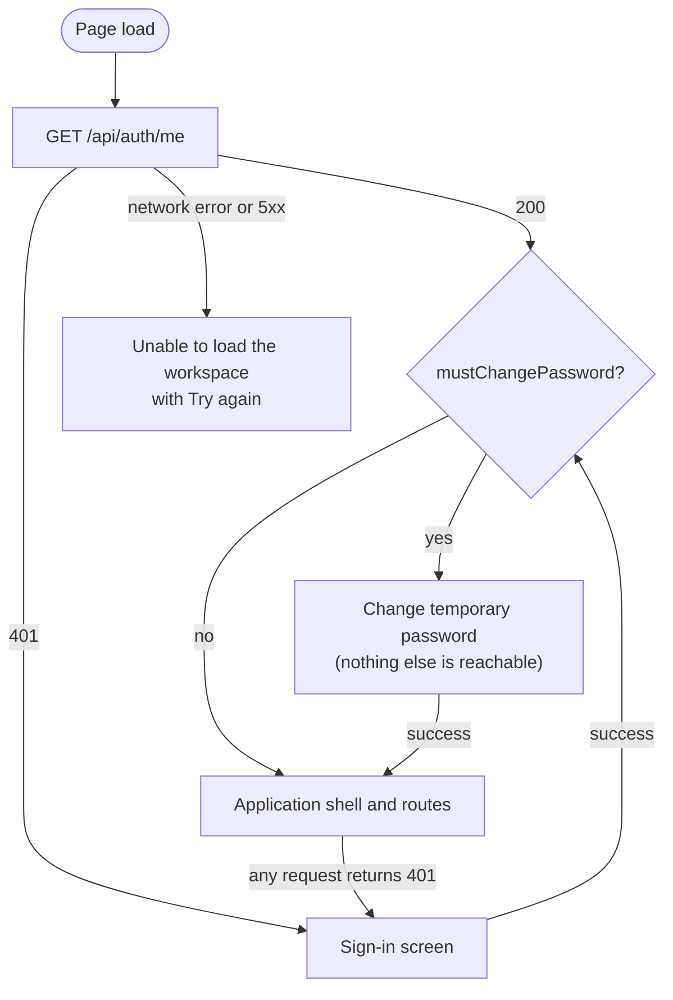

# 9. Frontend

> Part of the [Invoice Exception Assistant specification](./README.md). Applies to version **1.0.0**.

The browser application is a React 18 single-page app built with Vite and TypeScript. It is a **thin client**:
it renders what the server returns, collects input, and shows errors. It makes no business decisions and holds
no durable data. Source: [`src/`](../src).

## 9.1 Overview and boot sequence

[`main.tsx`](../src/main.tsx) mounts, from the outside in: `ErrorBoundary` → `AppStateProvider` →
`RouterProvider` (a React Router *data router*, which is what enables unsaved-change blocking) → `App`.

Key behaviors:

- A failed session probe (server down, proxy error) shows an explicit **error with retry** — it is *not*
  treated as "signed out", so a transient outage never looks like a sign-out.
- When any request comes back `401` (other than a failed login), the session is cleared and the app returns to
  the sign-in screen; because the shell unmounts, **no confidential data stays on screen**.
- Nothing is persisted in the browser: no `localStorage`, `sessionStorage`, IndexedDB, or JavaScript-visible
  cookies. The CSRF token lives in a React ref.
- An error boundary catches rendering failures and shows "Something went wrong — saved data remains on the
  server" with a reload button.
- `index.html` includes a `<noscript>` message and a favicon; the page is otherwise empty until the bundle runs.

## 9.2 Route map

URLs are real paths, so reload and deep links work (the server returns `index.html` for unknown extension-less
paths).

| Path | Screen | Access | Notes |
| --- | --- | --- | --- |
| `/` | Dashboard | any user | |
| `/invoices` | Invoice queue | any user | |
| `/invoices/new` | New invoice (intake) | any user | Static route takes precedence over the `:invoiceId` pattern |
| `/invoices/:invoiceId` | Invoice review | any user | `key={invoiceId}` remounts state when navigating between invoices |
| `/exports` | Exports | any user | |
| `/reference-data` | Reference data (`?kind=suppliers\|purchase-orders\|deliveries`) | administrator | Reviewers see "Administrator access required" |
| `/users` | Team access | administrator | Same guard |
| `/account` | Your account (change password) | any user | |
| `*` | "Page not found" | any user | Button back to the overview |

While a temporary password is in force, **every** path renders only the forced change-password screen. The
sidebar (desktop) and bottom bar (mobile) hide the administrator entries from reviewers — a convenience; the server
enforces access ([§8.5](./08-security.md#85-authorization)).

## 9.3 State management and data access

There is no Redux or query library. Three small pieces cover everything
([`appState.tsx`](../src/state/appState.tsx), [`api.ts`](../src/services/api.ts)):

**`AppStateProvider`** holds the session (`user`), the CSRF token (in a ref), `loading` / `authError` for the
initial probe, and a numeric **`revision`**. It exposes `login`, `logout`, `changePassword`, `request`,
`download`, `refresh` and `retrySession`.

**`request(path, options)`** wraps `fetch`: same-origin credentials, `cache: no-store`, `Accept: application/json`,
the `X-CSRF-Token` header when signed in, JSON bodies (or `FormData` untouched so the browser sets the
multipart boundary), and a check that successful responses really are JSON (otherwise `INVALID_RESPONSE` —
usually a proxy serving HTML). Failures become an **`ApiError`** carrying `status`, `code`, a message that includes
field-level validation details, and the server's `requestId`; network failures become `NETWORK_ERROR`.
`401` handling is centralized here.

**`useResource(path)`** is the read hook. It fetches on mount and when `path`, `revision` or a manual `reload`
changes; **aborts** superseded requests so a slow earlier response can never overwrite a newer one; keeps the
previous data for the *same* path while reloading (no flicker); and exposes `{ data, loading, error, reload }`.
Passing `null` disables the fetch (used for disabled pickers).

**`refresh()`** increments `revision`, re-running every mounted `useResource`. It is called after every
successful mutation, on login/logout, and by the top-bar **Refresh** button. There is **no automatic polling or
push**: another user's changes appear when you refresh or navigate.

**`useDebouncedValue`** (200 ms) debounces search boxes, so typing does not issue a query per keystroke.

There are **no optimistic updates**: the UI changes only after the server confirms.

## 9.4 Screens

### Sign-in
E-mail + password; shows the server's generic failure message; explains that accounts are created by an
administrator. No registration or "forgot password" flow exists.

### Change password (forced and voluntary)
Current password, new password (12–128 characters, validated with the shared schema), confirmation. The forced
variant offers *Sign out*. On success the old sessions are gone and a new one is already in place.

### Dashboard
Greeting and date; four **cards** — *Needs attention* (needs review + possible duplicate + correction
requested + escalated), *Matched*, *Ready for export*, *Exported*; **Priority review** (oldest four unresolved
invoices); **Recent activity** (latest five history events); an export banner linking to Exports; and, for an
administrator on an empty workspace, an **onboarding** card pointing to Reference data and Team access.

### Invoice queue
Server-side **search** (invoice number, supplier, PO), **status filter**, **sort** (newest, oldest, highest
amount, supplier A–Z) and **pagination**. Each row shows supplier, date, amount, PO, status pill and the
**live exception reason**. Changing a filter resets to page 1. Explicit loading, error-with-retry and empty states.

### New invoice (intake)
The shared **invoice form** plus an optional **document** panel: drag-and-drop or *Choose file*; exactly one file;
PDF/PNG/JPEG; non-empty and ≤ 10 MiB (checked client-side for fast feedback, and again by the server). Images
get a local preview; PDFs show a note that they are stored and downloaded, not embedded. After *Save draft* the
user lands on the new invoice's review page. Retry-safe: see [§9.6](#96-forms-validation-and-idempotency).

### Invoice review
- **Header:** invoice number (or "Unnumbered draft"), version, status pill, supplier and total.
- **Decision panel** (editable invoices): a *Review note* box; **Request correction**, **Escalate**, **Void
  invoice** (each disabled until a note is typed); **Approve for export**, disabled while any exception exists
  or while loading, with the text "Approval is blocked until every exception is resolved. There is no
  override." Administrators also see **Reopen invoice** on `ready_to_export` invoices (note required). Reviewers
  see no decision panel for approved invoices; exported and voided invoices show a "locked" notice.
- **Edit invoice:** opens the invoice form pre-filled (with the current supplier/PO/receipt labels), requires a
  *Reason for changes*, keeps the user's input if saving fails, and offers *Discard edits and reload latest
  version*.
- **Exceptions panel:** each exception as a card with severity, explanation, source values and calculation; or a
  "No exceptions found" banner.
- **Three-way comparison:** per line — invoice qty, PO qty, received qty, invoice price, PO price, and a
  *Match/Check* flag (Check when the line has no PO line, no receipt line, or any live exception whose ID ends
  with that line's ID).
- **Source cards:** invoice, PO and receipt totals and dates.
- **Sidebar:** document name with an authenticated **Download source document** button (a `fetch` + blob
  download, not a link); **field provenance** (value, confidence badge or "Manual entry"); **review history**
  (paginated; each entry can expand *View saved version N* to show the stored snapshot as formatted JSON).
- After a decision the page shows "*<action> saved to the audit history. No external system was contacted.*"

### Exports
Lists `ready_to_export` invoices (oldest first, paginated) with checkboxes and a select-all-on-page box;
selection **persists across pages** up to 500. **Create CSV export (N)** posts the selection with a stable
request ID, then downloads the CSV. If the batch is saved but the download fails, the message says so and
points to **Export history** (paginated, each batch re-downloadable). A failed export keeps the selection;
*Clear selection and reload* refreshes stale versions.

### Reference data (administrators)
Tabs for **Suppliers**, **Purchase orders** and **Goods receipts** (kept in the URL as `?kind=`), a create form per
tab (with the shared line-item editor; receipts omit price), and a searchable, paginated list. A banner explains
that reference records are immutable.

### Team access (administrators)
*Create an account* (name, e-mail, role, temporary password; the notice states no e-mail was sent);
*Team members* table with role selector, enable/disable, and a collapsible *Set temporary password* form (your own row
is read-only); and the **administrative audit** list (paginated).

## 9.5 Shared components

| Component | Role |
| --- | --- |
| `Layout` | Skip link, desktop sidebar, top bar (Refresh, profile → account, Sign out), mobile bottom navigation, focus moved to the main region on page change, `aria-current` on the active item |
| `InvoiceForm` | The invoice editor used by intake and edit; client-side schema validation; PO line import; unsaved-change guard |
| `ReferenceSelect` | Searchable, paginated picker (20 per page) for suppliers / POs / receipts; PO list filtered by supplier and receipt list by PO; disabled until its parent is chosen; resets children when the parent changes; can show a fallback label for a value not on the current page |
| `LineItemsEditor` | Add/remove lines (max 100); SKU, description, quantity, unit price; live subtotal |
| `Feedback` | `ErrorMessage` (role `alert`, optional *Try again*), `Loading` (role `status`), `Pagination`, `DownloadButton` (own busy/error state) |
| `StatusPill` | Status label and color |
| `UnsavedChanges` | Blocks in-app navigation and browser close while a form is dirty; "Keep editing" / "Discard changes and leave" |
| `ErrorBoundary` | Last-resort rendering-failure screen |

## 9.6 Forms, validation and idempotency

- **One schema, two places.** Forms parse with the same Zod schemas the server uses
  ([`validation.ts`](../src/domain/validation.ts)), so users get instant feedback and the browser submits the
  *parsed* (normalized) values. The server re-validates everything and is authoritative.
- **Whole-unit quantities, USD amounts with two decimals**, enforced by input attributes and the schema.
- **Incomplete drafts are allowed**; the form says so. Approval needs everything.
- **Retry-safe creation.** Intake keeps a `requestId` in a ref and reuses it while the payload and file are
  unchanged; changing either generates a new one ([§5.4](./05-invoice-lifecycle.md#54-idempotency)). Exports
  do the same for a given selection.
- **Unsaved changes** are guarded on intake, edit, and the reference/account creation forms.
- **Failure keeps input.** A failed save never clears the form.

## 9.7 Status vocabulary and visual language

| Status | Label | Pill color |
| --- | --- | --- |
| `needs_review` | Needs review | Amber |
| `possible_duplicate` | Possible duplicate | Red |
| `matched` | Matched | Green |
| `ready_to_export` | Ready to export | Blue |
| `correction_requested` | Correction requested | Tan |
| `escalated` | Escalated | Purple |
| `exported` | Exported | Dark green |
| `voided` | Voided | Gray |

Styling is a single hand-written stylesheet ([`styles.css`](../src/styles.css)): CSS custom properties for the
palette (navy, blue, green, amber, red), a **system font stack** (no web fonts — also required by the CSP), no CSS
framework, and no inline styles (also required by the CSP). Icons are short text glyphs rather than an icon
library or images.

## 9.8 Accessibility

Implemented: a **skip link**; programmatic **focus to the main region** after navigation; visible
`:focus-visible` outlines; explicit labels on form controls (visually hidden where the design omits them);
`role="alert"` for errors and `role="status"` for confirmations and loading; `aria-current="page"` navigation;
semantic tables with header cells; keyboard-operable controls throughout; `prefers-reduced-motion` support;
buttons for actions and links only for navigation.

**Not done:** no formal WCAG audit, screen-reader pass, or automated accessibility testing; color-contrast has
not been systematically verified; some icons are decorative text and are hidden from assistive technology.
Treat the above as good practice, not conformance.

## 9.9 Responsive design

Breakpoints in the stylesheet: **1280 px**, **1100 px**, **760 px** and **480 px**. Below 760 px the sidebar is
replaced by a scrolling bottom navigation bar, headings and action groups stack, forms collapse to one column,
and tables scroll horizontally inside their panels. The browser suite checks a 390 px-wide viewport for working
navigation, deep links, and **no horizontal page overflow**.

## 9.10 Performance and bundling

`vite build` produces one JavaScript bundle (~390 kB, ~117 kB gzipped at the last build) and one CSS file
(~22 kB, ~6 kB gzipped), both content-hashed. The API serves hashed assets with a one-year `immutable` cache and
the HTML shell with `no-cache`, so deployments take effect on the next load while repeat visits stay fast.
There is no code-splitting, service worker, or offline mode. Lists are server-paginated, so rendering cost is
bounded by page size.

## 9.11 Browser support

No `browserslist` is configured; the bundle targets Vite's default modern-browser baseline. Automated browser
tests run in **Chromium only**. Use a current evergreen browser.

## 9.12 Limitations

English only, US formatting for currency and the dashboard date (history timestamps use the viewer's locale);
no dark mode; no keyboard shortcuts; no bulk actions other than export selection; no real-time updates;
no offline use; no in-app help beyond inline hints; documents are download-only (no inline viewer).
