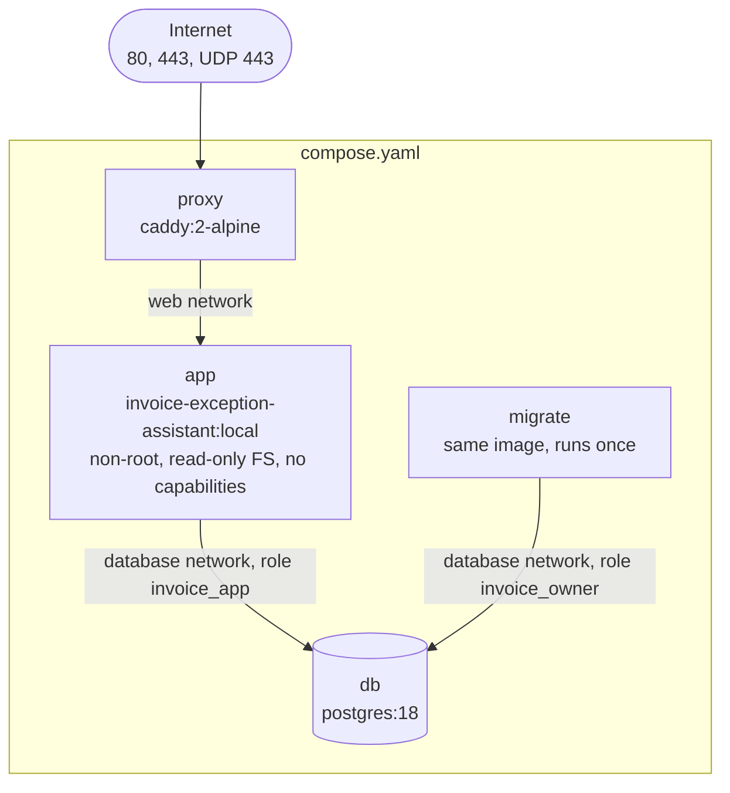

# 10. Configuration and deployment

> Part of the [Invoice Exception Assistant specification](./README.md). Applies to version **1.0.0**.

How the application is configured, which environments exist, how the production stack is assembled and started,
and how it is built and verified in CI. Step-by-step instructions for first setup are in the
[README](../README.md); runbooks are in [`docs/operations.md`](../docs/operations.md). This document explains the
*design* behind them.

## 10.1 Configuration model

- **Environment variables only.** There are no config files read by the server and no feature flags.
- **Validated at startup.** [`server/config.ts`](../server/config.ts) parses the environment with Zod. Any
  problem aborts the process before it listens, printing `Invalid configuration: <VAR>: <reason>; …` and exiting
  non-zero. The same loader runs for every CLI command.
- **`.env` is a development convenience.** `dotenv.config()` loads `./.env` if present and **does not override**
  variables already in the environment. dotenv does not expand `${VARIABLES}`, so each value must be written out
  literally (the reason `.env.example` repeats the database password).
- **Secrets never reach the browser.** There are no `VITE_*` variables; the bundle contains no configuration.

## 10.2 Environment variable reference

### Application and CLI

| Variable | Default | Validation and meaning |
| --- | --- | --- |
| `DATABASE_URL` | *(required)* | A URL with scheme `postgres:` or `postgresql:`. The API uses the **runtime role**; migrations use the **owner**. Use verified TLS if the database is reached over a network |
| `NODE_ENV` | `development` | `development`, `test` or `production` — see [§10.3](#103-environments) |
| `APP_ORIGIN` | `http://localhost:5173` | **Exact** browser origin: `http`/`https`, host, optional port; no path, no trailing slash, no credentials. Used for the `Origin` check. **Production requires `https://`** |
| `HOST` | `127.0.0.1` | Bind address (containers set `0.0.0.0`) |
| `PORT` | `3000` | 1–65535 |
| `TRUST_PROXY` | `0` | `0` (direct) or `1` (**exactly one** trusted reverse proxy). Controls how the client IP is derived for rate limiting. Never `1` unless the API is reachable only through that proxy |
| `SESSION_HOURS` | `8` | Integer 1–24. Absolute session lifetime and cookie `Max-Age` |
| `LOG_LEVEL` | `info` | `fatal`, `error`, `warn`, `info`, `debug`, `silent` |

### CLI inputs (set only for the command that needs them)

| Variable | Command | Rule |
| --- | --- | --- |
| `ADMIN_EMAIL` | `create-admin`, `reset-password`, `seed-demo` | Valid e-mail |
| `ADMIN_NAME` | `create-admin` | 1–100 chars |
| `ADMIN_PASSWORD` | `create-admin`, `reset-password` | 12–128 chars, not whitespace-only |
| `APP_DATABASE_PASSWORD` | `provision-app` | **Exactly 64 hexadecimal characters** |

### Compose-only

| Variable | Used in | Meaning |
| --- | --- | --- |
| `APP_DOMAIN` | `compose.yaml`, Caddy | Public DNS name only — no scheme, port or path. Becomes `APP_ORIGIN=https://<APP_DOMAIN>` and Caddy's site address |
| `POSTGRES_PASSWORD` | both Compose files | Password of the bootstrap superuser (`invoice_owner` in production, `invoice_dev` in development). **Never given to the running API** |
| `APP_DATABASE_PASSWORD` | `compose.yaml` | Runtime role password (also read by the `provision-app` step) |
| `SESSION_HOURS`, `LOG_LEVEL` | `compose.yaml` | Passed through to the API |
| `PGPORT` | `compose.dev.yaml` | Host port for the development database (default 5432) |

### Test-only

| Variable | Meaning |
| --- | --- |
| `TEST_DATABASE_URL` | Optional URL of a **disposable** PostgreSQL superuser connection for tests; otherwise an embedded cluster is started. Never a production URL |
| `CI` | Makes Playwright forbid `test.only` and retry once |

Templates: [`.env.example`](../.env.example) (development) and
[`.env.production.example`](../.env.production.example) (production).

## 10.3 Environments

| | Development | Automated tests | Production |
| --- | --- | --- | --- |
| Start with | `npm run dev` | `npm test`, `npm run test:integration`, `npm run test:e2e` | `docker compose --env-file .env.production up -d --build` |
| `NODE_ENV` | `development` | `test` | `production` |
| UI served by | Vite dev server on **5173** (HMR), proxying `/api` → `127.0.0.1:3000` | The API (e2e, on **4173**) | The API behind Caddy |
| API serves `dist/` | No | Yes | Yes |
| Origin | `http://localhost:5173` | `http://127.0.0.1:4173` (e2e) | `https://<APP_DOMAIN>` |
| Cookie | `invoice_session`, not `Secure` | same | `__Host-invoice_session`, `Secure` |
| HSTS / `upgrade-insecure-requests` | off | off | on |
| Database | Local Postgres (`compose.dev.yaml`) or any instance | Embedded ephemeral PostgreSQL | `postgres:18` container |
| Demo seeding | Allowed | Used by tests | **Refused** |

Development specifics: the Vite server uses `strictPort` (fails rather than picking another port). You must
open the app at **exactly** the origin in `APP_ORIGIN` — `localhost` and `127.0.0.1` are different origins.

## 10.4 Production topology



| Service | Image | Networks | Published ports | Highlights |
| --- | --- | --- | --- | --- |
| `db` | `postgres:18` | `database` (internal) | none | `scram-sha-256` auth; volume `production_database`; healthcheck `pg_isready`; `restart: unless-stopped` |
| `migrate` | app image | `database` | none | `sh -c "node build/server/cli.js migrate && node build/server/cli.js provision-app"`; owner credentials; runs once (`restart: "no"`); read-only FS, `cap_drop: ALL`, `no-new-privileges` |
| `app` | app image | `database`, `web` | none (`expose 3000`) | Runtime-role credentials only; `TRUST_PROXY=1`; `HOST=0.0.0.0`; read-only FS with a 32 MiB `tmpfs` at `/tmp`; `cap_drop: ALL`; `no-new-privileges`; `init: true`; 512 MiB memory limit; `stop_grace_period: 15s`; `depends_on: migrate (completed)` |
| `proxy` | `caddy:2-alpine` | `web` | **80, 443, 443/udp** | Config mounted read-only from `deploy/Caddyfile`; volumes `caddy_data`, `caddy_config`; waits for `app` to be healthy |

Named volumes: `production_database` (all business data), `caddy_data` (certificates and ACME state),
`caddy_config`. The `database` network is `internal: true`, so the database can neither be reached from outside
nor reach out.

## 10.5 Container image

[`Dockerfile`](../Dockerfile), two stages on `node:24-bookworm-slim`:

1. **build** — `npm ci` (all dependencies), copy the source, `npm run build` (type-check, compile server, copy
   migrations, build the UI).
2. **production** — `NODE_ENV=production`; `npm ci --omit=dev --ignore-scripts`; copy only `build/` and
   `dist/` from the first stage; run as `USER node`; `EXPOSE 3000`; **`HEALTHCHECK`** every 30 s (5 s timeout,
   15 s start period, 3 retries) calling `GET /api/health/ready`; `CMD node --enable-source-maps
   build/server/index.js`.

The image tag `invoice-exception-assistant:local` is shared by `migrate` and `app`; it is **built locally by
Compose** — no registry is involved. The image contains the compiled sample dataset module, but seeding is
disabled in production at run time. [`.dockerignore`](../.dockerignore) excludes secrets, tests' output, `images/`,
and `pgm.py`.

## 10.6 Reverse proxy

[`deploy/Caddyfile`](../deploy/Caddyfile):

```text
{$APP_DOMAIN} {
    encode zstd gzip
    request_body { max_size 11MB }
    reverse_proxy app:3000 { transport http { dial_timeout 5s  response_header_timeout 30s } }
}
```

- A site address with a real hostname makes Caddy **obtain and renew certificates automatically** and redirect
  HTTP to HTTPS. That requires public DNS pointing at the host and ports 80/443 reachable; certificate state is
  kept in `caddy_data`.
- `max_size 11MB` sits just above the 10 MiB document limit (plus multipart overhead); the API enforces the
  precise limits.
- `reverse_proxy` adds the forwarded-client headers the API reads when `TRUST_PROXY=1`. The **application**,
  not Caddy, adds HSTS and the other security headers ([§8.9](./08-security.md#89-http-security-headers-and-browser-protections)).
- Caddy is not configured with access logging; the application's own request log is the record of requests.

## 10.7 Startup order and bootstrap

1. `db` starts and becomes healthy.
2. `migrate` applies migrations and (re)provisions the runtime role, then exits `0`. If it fails, `app` never starts.
3. `app` starts, **verifies the schema is current**, listens, and becomes healthy.
4. `proxy` starts once `app` is healthy and begins serving TLS.
5. **Manual, once:** create the first administrator with `create-admin` (there are no default credentials), then
   sign in and verify (see the README).

## 10.8 CLI reference

Entry point [`server/cli.ts`](../server/cli.ts) (`node build/server/cli.js <command>` in containers; `tsx
server/cli.ts <command>` in development). Exit code `0` on success, `1` with a message on stderr otherwise.

| Command | npm script | Needs | Effect |
| --- | --- | --- | --- |
| `migrate` | `db:migrate` | Owner `DATABASE_URL` | Apply pending migrations under a lock |
| `provision-app` | – (used by the migrate job) | Owner `DATABASE_URL`, `APP_DATABASE_PASSWORD` | Create/refresh the runtime role and re-apply its exact grants |
| `create-admin` | `admin:create` | `ADMIN_EMAIL`, `ADMIN_NAME`, `ADMIN_PASSWORD` | Insert an active administrator with **no** forced password change; audited as `admin_bootstrapped`. Fails if the e-mail exists |
| `reset-password` | `admin:reset-password` | `ADMIN_EMAIL`, `ADMIN_PASSWORD` | Set a new password, **require a change**, revoke the account's sessions; audited. Works for any existing account but does **not** re-enable a disabled one |
| `seed-demo` | `db:seed` | `ADMIN_EMAIL` (an existing administrator) | Load the [sample dataset](./03-domain-model.md#312-sample-dataset) into an **empty, non-production** database |

Run `create-admin`/`reset-password` inside the `app` container (the runtime role is sufficient). Pass
`ADMIN_PASSWORD` through the environment (`-e ADMIN_PASSWORD`) from a prompt rather than on the command line, and
`unset` it afterwards.

## 10.9 Release, upgrade and rollback

Summary (full commands in [`docs/operations.md`](../docs/operations.md)): **back up → rehearse on a restored
staging copy → build → stop `proxy` and `app` → run `migrate` → `up -d` → verify**. Migrations are forward-only.
**Rollback is a backup restore (or a forward-fix migration), not a redeploy of old code**: an older image against
a newer schema is not detected by the startup check ([§6.7](./06-data-and-persistence.md#67-migrations)).
Never run `docker compose down -v` against production — it deletes the database volume.

## 10.10 Continuous integration

[`.github/workflows/ci.yml`](../.github/workflows/ci.yml) runs on pull requests, pushes to `main`/`master` and
manual dispatch, with read-only token permissions, one run per ref (older runs canceled) and a 20-minute limit:

1. Checkout; Node from `.nvmrc`; `npm ci` (cached).
2. **`npm run check`** — ESLint → type-check/build → unit/UI tests with coverage gates → API integration tests
   with coverage gates (embedded PostgreSQL, no service container needed).
3. Install Chromium and run the **Playwright** suite against the production build.
4. `npm audit --omit=dev --audit-level=high`.
5. Validate both Compose files (`docker compose config --quiet`) with placeholder secrets.
6. **Build the production image**, bring up `db` → `migrate` → `app` (waiting for health), validate the Caddyfile
   with `caddy validate`, create an administrator through the CLI, and run
   [`tests/container-smoke.mjs`](../tests/container-smoke.mjs) *inside* the app container: readiness, static
   shell with the CSP, login with a `__Host-` `Secure` cookie, and a write through the **restricted runtime
   role**. Containers and volumes are always torn down afterwards.
7. Upload coverage, Playwright reports and traces as artifacts (14 days).

[`.github/dependabot.yml`](../.github/dependabot.yml) opens weekly update PRs for npm, Docker and GitHub Actions.

**CI does not deploy anything**, publish an image, scan images, sign artifacts, or produce a changelog. The
local workspace is not currently a Git repository; the workflow takes effect once the project is pushed to GitHub.

## 10.11 Running somewhere other than the supplied Compose stack

> This section is **guidance**, not something the repository's tests exercise.

- **Behind your own proxy or load balancer:** set `APP_ORIGIN` to the public HTTPS origin; set `TRUST_PROXY=1`
  only if exactly one proxy hop sits in front; forward the original `Origin` header unchanged; allow bodies of at
  least 11 MB and idle/response timeouts of at least 30 s; use `/api/health/ready` for readiness and
  `/api/health/live` for liveness. Do not expose the API's port directly.
- **Several API replicas:** supported — sessions, counters and locks are in PostgreSQL. All finance writes are
  serialized by the global lock, and each replica has its own 10-connection pool.
- **Managed PostgreSQL:** the `provision-app` step is written for an owner with superuser-equivalent rights (the
  Compose default). If your provider's admin role cannot create roles with these attributes, create the runtime
  role yourself, apply the grants from [§6.8](./06-data-and-persistence.md#68-database-roles-and-privileges) by hand,
  and run only `migrate` as the owner. Use TLS with certificate verification in `DATABASE_URL`.
- **Kubernetes or similar:** run the migrations as a one-shot Job before rolling out the Deployment; allow a
  termination grace period of at least 15 s (the process drains for up to 10 s on `SIGTERM`); keep a writable
  `/tmp`; mount secrets as environment variables.

## 10.12 Where the launch checklists live

- Configuration and hardening → [§8.14](./08-security.md#814-verification).
- Backups, restore drill and monitoring → [§12](./12-operations.md).
- Product limits to confirm against your requirements → [§13](./13-limitations-and-roadmap.md).
