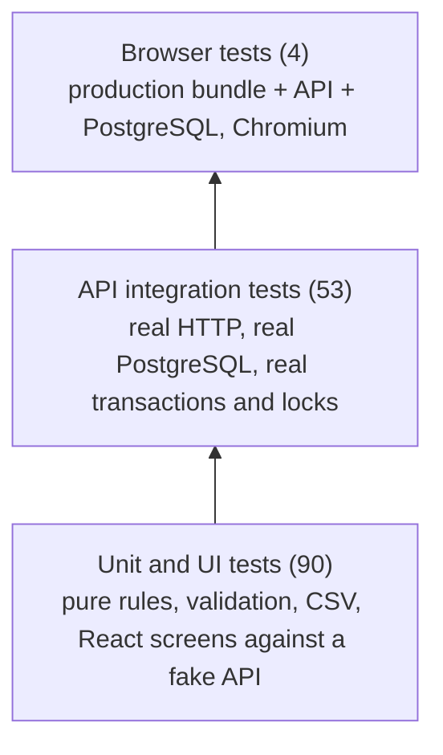

# 11. Testing and quality

> Part of the [Invoice Exception Assistant specification](./README.md). Applies to version **1.0.0**.

The test strategy is to prove behavior at the cheapest layer that can show it, while exercising the **real**
database and the **real** production bundle wherever correctness depends on them. A shorter how-to is in
[`docs/testing.md`](../docs/testing.md); this document explains what exists, why, and what it does not cover.

## 11.1 Strategy

| Layer | Tooling | What it is good at | Deliberately not used for |
| --- | --- | --- | --- |
| **Unit / UI** — 8 files, 90 tests | Vitest 5 + jsdom + Testing Library + user-event | Rule engine edge cases, validation limits, money, CSV safety, React behavior, error/empty/retry states | Anything that depends on SQL, locks or real cookies |
| **API integration** — 3 files, 53 tests | Vitest (node) + embedded PostgreSQL 18 + real `fetch` | Workflows, concurrency, permissions, immutability, idempotency, sessions, headers, migrations, database privileges | Rendering |
| **End-to-end** — 1 file, 4 tests | Playwright (Chromium) | The compiled app as a user drives it, including uploads, downloads, reloads and a 390 px viewport | Edge cases (too slow) |

**Principle:** *the database is never mocked in server tests.* Mocks would hide exactly the properties the design
relies on (the global lock, `UNIQUE` constraints, triggers, privileges, transaction rollback).

## 11.2 Commands

| Command | What it does |
| --- | --- |
| `npm run typecheck` | Strict `tsc --noEmit` for the app, server and tooling projects |
| `npm run lint` | ESLint (zero errors required) |
| `npm test` / `npm run test:watch` | Unit/UI tests, once or watching |
| `npm run test:coverage` | Unit/UI tests + enforced coverage thresholds |
| `npm run test:integration` | API tests against embedded PostgreSQL |
| `npm run test:integration:coverage` | API tests + enforced coverage thresholds |
| `npm run test:e2e` | `npm run build`, then Playwright (starts its own database and server on port 4173) |
| `npm run test:all` | Unit/UI, API and browser tests |
| `npm run check` | Lint → build (incl. type-check) → both coverage-gated suites (what CI runs first) |

Run a subset with the runner's filters, e.g. `npm test -- src/services/invoiceChecks.test.ts`,
`npm run test:integration -- -t "concurrent approvals"`, `npx playwright test -g "reviewer mobile"`. After
changing app code, prefer `npm run test:e2e` (it rebuilds) so a stale `build/`/`dist/` is never tested.

## 11.3 Inventory

Counts as of 2026-10-02: **90 + 53 + 4 = 147 tests, all passing.**

### Unit and UI (`src/**/*.test.ts[x]`)

| File | Tests | Covers |
| --- | ---: | --- |
| `src/domain/money.test.ts` | 3 | Cent arithmetic without floating-point drift; zero and the maximum total; currency formatting |
| `src/domain/validation.test.ts` | 19 | Every schema: incomplete drafts allowed, unknown keys rejected, money/quantity bounds, total ceiling, NFKC/whitespace/control-character handling, duplicate SKUs and line limits, calendar dates and ordering, review-reason rules, export shape limits, e-mail/password rules, reference-data requirements, query defaults and unsafe sort values |
| `src/services/invoiceChecks.test.ts` | 12 | Duplicate normalization and exclusions; **exact** price-tolerance boundaries; zero-price POs; unknown SKUs; cumulative quantity reservation (and non-self-reservation); required fields; cross-linked PO/receipt; confidence threshold |
| `src/utils/csv.test.ts` | 10 | Export eligibility; formula neutralization (6 prefixes); RFC-style quoting; header-only output; failure on missing references |
| `src/services/api.test.ts` | 6 | Same-origin credentials and CSRF header; multipart left to the browser; validation details and request IDs; network and non-JSON failures; external-path refusal; abort handling; blob download cleanup |
| `src/state/appState.test.tsx` | 12 | Sign-in with deep link preserved; login errors; recoverable session-probe failure; 401 clears the UI; failed logout stays signed in; forced password change; password-form validation and server errors; successful password change from the account page; reviewer cannot reach admin pages; unknown route; stale-response cancellation; unsaved-change guards |
| `src/screens/workflows.test.tsx` | 25 | Dashboard/onboarding; queue search/filter/sort/pagination/errors; review decisions, version conflicts, edit-and-verify, save-failure retention, history snapshots and paging, admin reopen, voided drafts; intake (manual draft, retry keeps request ID, file validation, multipart, PO-line import, date validation); exports (select/create/download, saved-but-download-failed, failure keeps selection); reference data; account administration |
| `src/components/ErrorBoundary.test.tsx` | 3 | Boundary renders children, recovers from a render failure, and the loading/error components |

### API integration (`tests/*.integration.test.ts`)

| File | Tests | Covers |
| --- | ---: | --- |
| `tests/api.integration.test.ts` | 47 | **Access:** health, unauthenticated denial, opaque HttpOnly sessions, non-enumerating login, Origin and CSRF rejection, expiry and disabled accounts, shared rate limits, role restrictions, temporary-password rotation, session revocation, self-management guard, production cookie/HSTS. **Workflow:** server-side pagination/search/sort, dashboard counts, incomplete drafts, every exception blocking approval, edit-and-verify with snapshots, stale versions, reasons and real actor names, duplicate resolution by voiding, Unicode-normalized duplicate keys, admin-only reopen, forged input, idempotent creation, cross-account replay, **concurrent approvals**, immutable history. **Documents/exports/reference:** document persistence and download headers, upload rejections, exactly-once recoverable exports, rejected exports, export-time recheck, reference creation and immutability, malformed JSON and limits, masked database errors and migration drift, security headers, **cross-instance sessions**, idempotent migrations and reseed refusal |
| `tests/config.integration.test.ts` | 3 | Configuration validation (origin, protocol, production HTTPS, `TRUST_PROXY`, `SESSION_HOURS`); independent salts and corrupt-hash rejection |
| `tests/permissions.integration.test.ts` | 3 | The **restricted runtime role** can run the full workflow (admin, approve, export) yet cannot delete finance rows, rewrite history/audit/exports, or alter schema; provisioning validation and re-application |

### End-to-end (`tests/e2e/workspace.spec.ts`)

| Test | Journey |
| --- | --- |
| admin configures real references, uploads, edits, approves, exports and reloads | Create supplier → PO → receipt → invoice with a PNG; approval blocked → edit price → approve; reload; download the document; create a CSV export; history persists; invoice locked |
| admin provisions a reviewer and temporary password flow works end to end | Create account; the new user is forced to change password, cannot reach admin pages; disabling the account ends their session |
| reviewer mobile navigation, deep links, exception safeguards, and no page overflow | 390 px viewport; mobile navigation; search; exception blocks approval; reload on a deep link; no horizontal overflow; sign out |
| API errors remain JSON and static deep links retain restrictive headers | `401` JSON for the API; SPA shell with CSP and `no-cache`; missing static file is `404` |

## 11.4 Test infrastructure

| Piece | Purpose |
| --- | --- |
| [`src/test/setup.ts`](../src/test/setup.ts) | jest-dom matchers; React Testing Library cleanup after each test |
| [`src/test/helpers.tsx`](../src/test/helpers.tsx) | `mockApi({ user, data, handle })` stubs `fetch` with an in-memory fake of the API (and an override hook per test); `renderApp(path)` mounts the real `<App/>` in a memory router; fixtures for users, sessions, invoice detail and summaries |
| [`tests/database.ts`](../tests/database.ts) | `startTestDatabase()` — by default starts an **ephemeral embedded PostgreSQL 18** in a temp directory with a random password and port; if `TEST_DATABASE_URL` is set, uses that server and creates/drops a uniquely named `invoice_test_*` database |
| [`tests/global-setup.ts`](../tests/global-setup.ts) | Starts the database once per integration run and provides its URL to tests |
| `tests/api.integration.test.ts` helpers | A `Client` class that keeps the cookie and CSRF token, and a per-test reset: truncate all tables, insert an administrator and a reviewer (password hashed once), load the sample dataset |
| [`tests/e2e-server.ts`](../tests/e2e-server.ts) | Starts a database, migrates, creates two users and the sample data, then spawns the **compiled** server (`build/server/index.js`) on `127.0.0.1:4173`; tears everything down on `SIGTERM` |
| [`playwright.config.ts`](../playwright.config.ts) | One worker, Chromium desktop, never reuses an existing server, traces/screenshots on failure, HTML report |

**Isolation and safety**

- Every run gets its own database name; generated credentials are random and never reused.
- `TEST_DATABASE_URL` must point at a **disposable** cluster. The permission suite creates and drops a test role
  with privileged attributes, so it needs a **superuser** connection. Never use a production URL.
- Embedded PostgreSQL refuses to run as root; use a normal user (or an external disposable server).
- All fixtures and passwords are synthetic and test-only.

## 11.5 Quality gates

| Gate | Threshold / rule | Where |
| --- | --- | --- |
| Type-check | `strict`, zero errors, across app, server and tooling | `npm run typecheck`, part of `npm run build` |
| Lint | ESLint 10 with typescript-eslint recommended + React hooks rules (`exhaustive-deps` as error); unused variables are errors (prefix `_` to ignore an argument). Narrow, commented exceptions: `no-namespace` for Express `Locals` augmentation; `no-control-regex` where matching control characters is the point | `npm run lint` |
| Unit/UI coverage | lines/functions/statements ≥ **80 %**, branches ≥ **75 %** over `src/domain`, `invoiceChecks`, `csv`, `state`, `screens`, `components` | `vitest.config.ts` |
| API coverage | lines/statements ≥ **85 %**, functions ≥ **90 %**, branches ≥ **80 %** over `accounts`, `app`, `auth`, `catalog`, `config`, `database`, `invoices`, `repository`, `seed` | `vitest.integration.config.ts` |
| Dependency audit | No high-severity production vulnerabilities | CI |
| Containers | Compose files validate; image builds; stack starts; smoke test passes | CI |

**Coverage snapshot (2026-10-02)**

| Scope | Statements | Branches | Functions | Lines |
| --- | ---: | ---: | ---: | ---: |
| Unit/UI | 94.5 % | 92.4 % | 89.8 % | 97.1 % |
| API | 95.9 % | 92.2 % | 97.3 % | 97.5 % |

Not measured by the gates: `server/index.ts` (process lifecycle), `server/cli.ts`, `server/errors.ts`,
`src/App.tsx`, `src/main.tsx` and the browser HTTP client `src/services/api.ts` (the last is unit-tested but not
in the include list). Coverage is a guardrail, not a proof of correctness.

## 11.6 Traceability

Each system invariant ([§5.9](./05-invoice-lifecycle.md#59-system-invariants), `INV-01`…`INV-20`) names the test(s)
that demonstrate it, and the security controls in [§8.14](./08-security.md#814-verification) do the same. When you add
a guarantee, add an invariant row and a test, and keep the test name descriptive enough to quote.

## 11.7 What is not tested

| Area | Status |
| --- | --- |
| Container runtime, Caddy TLS issuance, real DNS | Only in CI (build, start, smoke); not executed locally in this workspace |
| Backup/restore and disaster recovery | Documented ([§12](./12-operations.md)); **not automated** — rehearse it |
| Browsers other than Chromium; real mobile devices | Not covered |
| Accessibility (screen readers, contrast, WCAG) | No audits or automated checks |
| Load, soak and performance | None; the global lock and 10-connection pool have never been load-tested |
| Penetration/fuzz testing, dependency-confusion checks | None |
| Upgrade paths from older schemas | Only one migration exists |
| `server/index.ts` signal handling and the hourly cleanup timer; CLI wrappers | No direct tests (the CLI's `create-admin` runs in the CI container smoke) |
| Visual regression | None |

## 11.8 Writing tests — guidance

1. **Pick the lowest layer that can fail for the right reason.** A rule → unit test with fixtures. A workflow,
   permission or concurrency property → integration test through the HTTP `Client`. UI states → `mockApi` + user-event.
   A cross-stack journey → Playwright.
2. **Assert the effect, not just the response.** For workflows also check history rows, versions, or that
   **nothing changed** after a rejection.
3. **Query the UI like a user:** `getByRole`, labels and accessible names — no test IDs.
4. **No sleeps.** Wait on observable conditions. Search boxes are debounced (200 ms); use `waitFor`.
5. **Keep data synthetic** and self-contained; never read real secrets or point at a real database.
6. When a test reveals a new guarantee, add an `INV-xx` row ([§5.9](./05-invoice-lifecycle.md#59-system-invariants)).

## 11.9 Troubleshooting

| Symptom | Cause / fix |
| --- | --- |
| Embedded PostgreSQL fails to start | Running as root, or the first-run binary download was blocked. Use a normal user, or set `TEST_DATABASE_URL` to a disposable superuser connection |
| Playwright refuses to start the server | Port 4173 is in use (the config never reuses a server). Stop the other process |
| Browser tests fail after a code change | Stale build. Use `npm run test:e2e`, which rebuilds first |
| "Executable doesn't exist" from Playwright | Run `npx playwright install chromium` |
| Permission test errors about role attributes | `TEST_DATABASE_URL` is not a superuser connection |
| Integration run takes 30–40 s | Expected: every run initializes a fresh embedded PostgreSQL cluster, and the suite includes real password hashing and concurrency tests |
